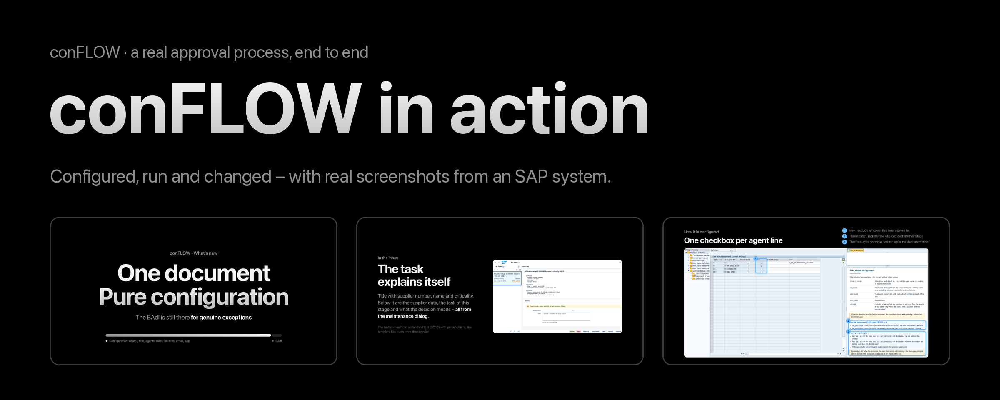

# conFLOW - SAP Workflows Made Easy


**English:** this documentation is also available [in English](en/README.md).


## conFLOW in Aktion

Ein echter Genehmigungsprozess von Anfang bis Ende: wie er eingerichtet wird, wie er läuft und wie leicht er sich ändern lässt. Mit Screenshots aus einem SAP-System, zum Durchklicken (auf Englisch).

<a href="https://story.conflow-help.com" class="button primary">conFLOW in Aktion ansehen →</a>

<figure><figcaption>
<a href="https://story.conflow-help.com">story.conflow-help.com</a>
</figcaption></figure>


**conFLOW** bildet Genehmigungs- und Freigabe-Workflows im SAP-System ab -- ohne SAP-Workflow-Know-how, ohne Workflow Builder, ohne WF-Customizing im SPRO.

Statt eines klassischen SAP-Workflows mit Aufgaben, Regeln und Schrittgruppen definiert der Anwender den Prozess in **Customizing-Tabellen**; nur für Sonderfälle kommt **eine BAdI-Klasse** dazu. Das Framework übernimmt den Rest: Workitem-Erzeugung, Bearbeiterfindung, Fristen, Eskalation, Mailversand und Statusverfolgung.


<figure><figcaption>
conFLOW - Workflows auf einfache Weise abbilden
</figcaption></figure>

## Was conFLOW kann

| Merkmal | Beschreibung |
| --- | --- |
| **Customizing statt Entwicklung** | Schritte, Übergänge, Bearbeiter, Regeln, Belegdaten, Knöpfe, Fristen und Mailversand werden in Tabellen gepflegt -- kein Workflow Builder, keine Aufgabendefinitionen |
| **BAdI für Ausnahmen** | Was das Customizing nicht abdeckt, gehört in eine Klasse je Workflow mit definierten Hooks -- Bearbeiterfindung, Beschreibung, Absprung, Nachlauf |
| **Beliebig viele Workflows** | Jede Workflow-Definition hat eine eigene Nummer und bei Bedarf eine eigene BAdI-Implementierung. Neue Prozesse benötigen keinen neuen Transport des Frameworks |
| **Hintergrundschritte** | Automatische Verarbeitung zwischen den Entscheidungen -- Anreicherung, Bewertung, Statusänderung, Belegbuchung |
| **Fristen und Eskalation** | Zeitgesteuerte Weiterleitung über Customizing, keine Deadline-Agents |
| **Parallele Genehmigung** | Mehrere Bearbeiter auf demselben Schritt -- alle entscheiden, Veto, erste Entscheidung oder Mehrheit, einstellbar je Schritt |
| **SAP-GUI und Fiori** | Workitems erscheinen im Business Workplace (SBWP) und in der Fiori My Inbox |
| **conMOBILE-Integration** | Mobile Darstellung jedes Workflow-Schritts über die conMOBILE-Plattform |

## Ein Workflow in einem Tag

Einen Standard-SAP-Workflow produktiv zu setzen dauert typischerweise zehn Tage: Aufgabendefinitionen, Regelauflösung, Schrittgruppen, Container-Operationen, Binding-Definitionen, Agenten-Ermittlung. Mit conFLOW reduziert sich das auf Customizing, eine ABAP-Klasse nur bei Bedarf -- der erste lauffähige Workflow steht am selben Tag.

<figure><figcaption>
Architektur und Einordnung im SAP-System
</figcaption></figure>

## Einstieg


[Beispiele realisierter Workflows](workflow-stories/beispiele-realisierter-user-stories/)



[Technische Dokumentation](technische-dokumentation/technische-dokumentation.md)



[How-To: Beispiel Workflow Krankmeldung](how-to-beispielimplementierung/beispiel-workflow-krankmeldung/)


## Kontakt


{% column width="66.66666666666666%" %}
**Johannes Zwinger – xsource consulting GmbH** Solution Architect conFLOW

Ich beantworte gerne Ihre Fragen zur Lösungsarchitektur, zur Integration in Ihre Systemlandschaft und zu Testinstallationen.

[johannes.zwinger@xsource-consulting.com](mailto:johannes.zwinger@xsource-consulting.com)


{% column width="33.33333333333334%" %}
<figure><figcaption></figcaption></figure>


