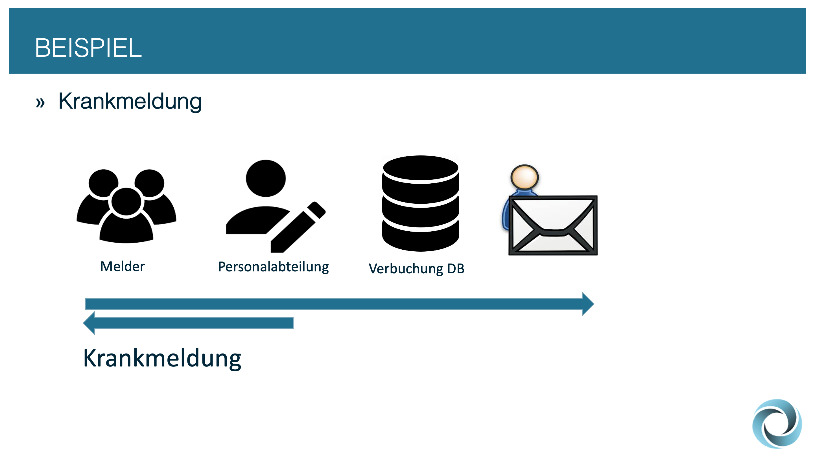

# How-to: sick leave workflow

This how-to shows step by step how to build a conFLOW workflow, using a sick leave notification as the example. At the end you have a working workflow that creates a work item in the inbox and documents the process.

## The process

| Step | Type | Who | What happens |
| --- | --- | --- | --- |
| `X0` | Start | System | The workflow is started |
| `01` | Dialog | Reporter | Enters the sick leave notification |
| `02` | Dialog | HR department | Processes and decides |
| `03` | Background | System | Follow-up processing |
| `X1` | End | System | Workflow completed (approved) |
| `X2` | End | System | Workflow completed (rejected) |

## Roles

| Role | Agent key (`gen_stat_user`) | Description |
| --- | --- | --- |
| Reporter | `WI` | The workflow initiator — determined automatically |
| HR department | `01` | Agent assigned in Customizing |
| Background | `BU` | Technical user `WF-BATCH` |

## Prerequisites

- Access to transaction `/C09/CONFLOW_C` (conFLOW Customizing)
- Development access for the BAdI implementation (SE80 or ADT)
- A transport request

## The four steps

<figure><figcaption>
Sick leave workflow: process overview
</figcaption></figure>

| Step | Content | Result |
| --- | --- | --- |
| [Step 1: Create the Customizing](step-1-customizing.md) | Workflow definition, steps, agents, process flow | Working workflow |
| [Step 2: Extend the Customizing](step-2-extend-customizing.md) | Background steps, texts, buttons, email notification | Fully configured process |
| [Step 3: BAdI implementation](step-3-badi-implementation.md) | Dynamic agent determination, parallel steps, navigation | Business logic |
| [Step 4: Start and test the workflow](step-4-start-and-test.md) | Trigger, container, test | Production-ready workflow |


**Keep the order:** Customizing first (steps 1 and 2), then the BAdI implementation (step 3), and the trigger last (step 4). The BAdI class builds on the Customizing entries, and the trigger requires a working workflow.

