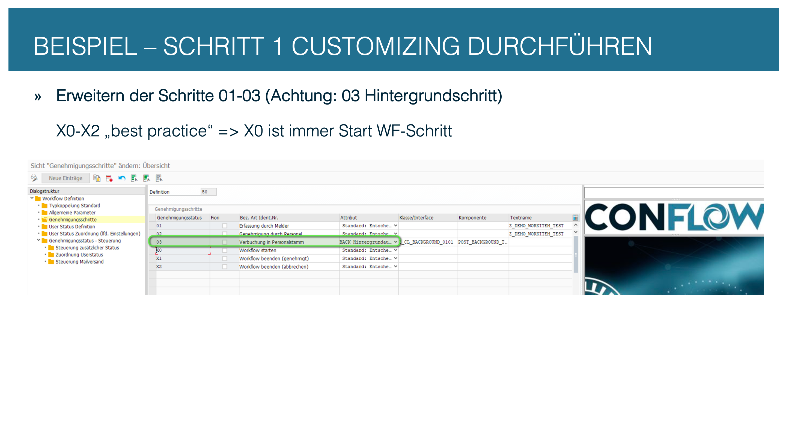
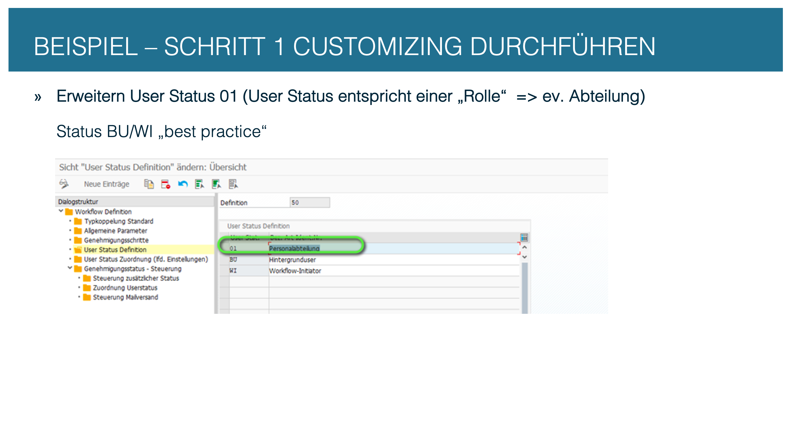
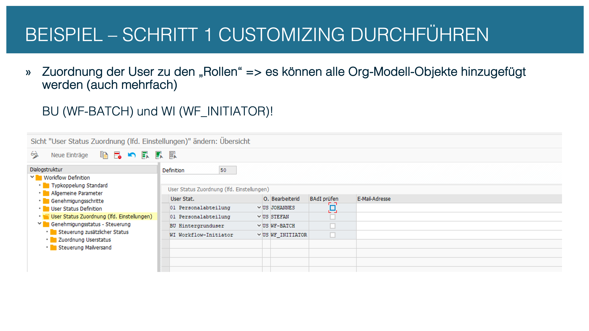
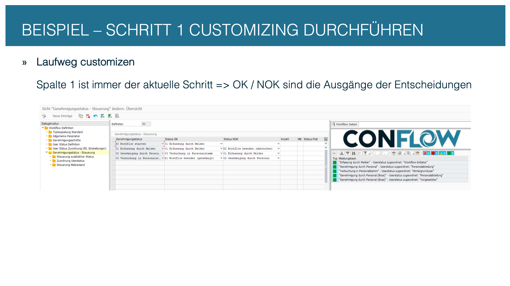
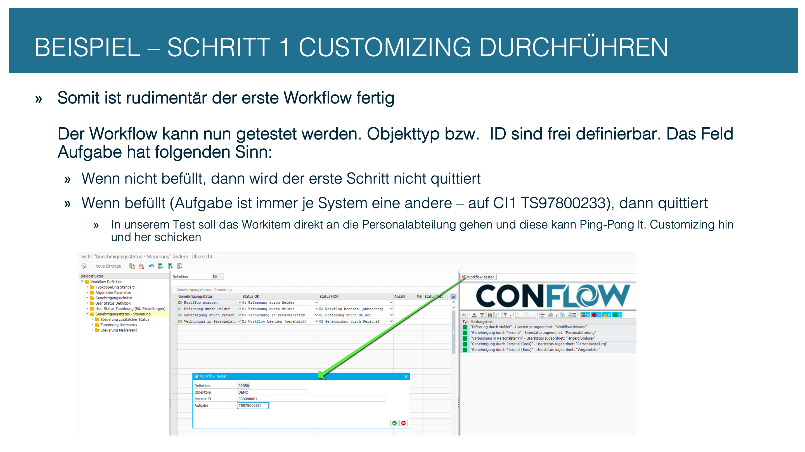

# Step 1: Create the Customizing

In this step you create the workflow definition and configure the process flow. At the end the workflow runs technically and can be tested — the business logic follows in the next steps.


**Screenshots in this how-to show the SAP GUI with German logon language.** The text always names the English node, as you see it when you log on in English (e.g. *Approval steps* instead of *Genehmigungsschritte*).


---

## 1.1 Create the workflow definition

Start transaction **`/C09/CONFLOW_C`**. Create a new workflow definition or copy template 1. The workflow number (e.g. `00100`) identifies the process across the whole system — it reappears in Customizing, in the BAdI class and in reporting.


**Tip:** Before creating it, check in `/C09/CFL_C06` that the number is still free. Each number may exist only once in the system.


<figure><figcaption>
Transaction /C09/CONFLOW_C: create the workflow definition
</figcaption></figure>

---

## 1.2 Define the approval steps

In the node **Approval steps** (`/C09/CFL_C01`) you create the individual steps. Each step has a status code (`gen_stat`) and a type:

| Type | Status code | Meaning |
| --- | --- | --- |
| Start | `X0` | **Required** — the first step of every workflow |
| Dialog | `01`, `02`, ... | Creates a work item in the agent's inbox |
| Background | `B1`, `B2`, ... | Automatic processing, no work item |
| End | `X1`, `X2`, ... | Ends the workflow. Every status starting with `X` is an end status |


**Best practice:** Use type `BACK_BATCH` for background steps (not `BACK`). `BACK_BATCH` runs as technical user `WF-BATCH`, `BACK` in the dialog of the current user. The older `BACK` is still supported but creates a work item in the inbox.


<figure><figcaption>
Approval steps: type, status code and order
</figcaption></figure>

---

## 1.3 Define the agent roles

In the node **User status definition** (`/C09/CFL_C04`) you create the roles used in this workflow. A role is an agent key (`gen_stat_user`) with a description.

Two roles are predefined as best practice:

| Key | Meaning |
| --- | --- |
| `BU` | Background user (`WF-BATCH`) for automatic steps |
| `WI` | Workflow initiator — the user who started the workflow |

Create further roles depending on the process, e.g. `01` for the HR department.

<figure><figcaption>
Define agent roles (gen_stat_user)
</figcaption></figure>

---

## 1.4 Assign agents

In the node **User status assignment (current settings)** (`/C09/CFL_C03`) you assign the actual agents to the roles. Assignment uses SAP organizational objects:

| Object type (`otype`) | Example | Meaning |
| --- | --- | --- |
| `US` | `MEIER` | Individual SAP user |
| `S` | `50000123` | SAP position |
| `AG` + column `AGR_NAME` | `Z_HR_ADMIN` | PFCG role: all dialog users of the role |
| `US` | `WF-BATCH` | Technical background user |
| `US` | `WF_INITIATOR` | Workflow initiator (dynamic) |


**Dynamic agent determination:** Set `user_badi = 'X'` in `/C09/CFL_C03` to delegate resolution to the BAdI method `GET_ACTORS`. The ABAP code then determines the agent at runtime, for example based on document data. See [Step 3: BAdI implementation](step-3-badi-implementation.md).


<figure><figcaption>
Assign roles to SAP users or organizational objects
</figcaption></figure>

---

## 1.5 Define the process flow

In the node **Approval status - control** (`/C09/CFL_C02`) you define which step follows which. Each step has two standard outcomes:

| Outcome | Field in `/C09/CFL_C02` | Meaning |
| --- | --- | --- |
| OK | `gen_stat_ok` | Approved / continue |
| NOK | `gen_stat_nok` | Rejected / back |

You can define up to five additional decision options (`UC1`–`UC5`) — this follows in [Step 2](step-2-extend-customizing.md).


**Required:** The entry point is always `X0`. The transition table must contain a row `gen_stat = 'X0'` with the first dialog step in `gen_stat_ok`. `X0` is the only status constant the framework expects hard-coded.


<figure><figcaption>
Transition table: step by step through the process
</figcaption></figure>

---

## 1.6 Link step and agent

In the node **Assignment of user status** (`/C09/CFL_C05`) you link each approval step to the role that processes it.


**Parallel steps:** Assign **several** agent keys to one approval step. conFLOW then creates a separate work item for each, and the workflow waits — with the default setting — until all of them have decided. Other rules (veto, first decision, majority) are set in Approval steps, column *Decision rule*.


<figure><figcaption>
Link: which role processes which step
</figcaption></figure>

---

## 1.7 Result: the workflow runs

From this point on, the workflow runs technically. The Customizing defines which steps exist, who processes them, in which order and with which outcomes. A start (e.g. via a test report or SWIA) creates a workflow instance and the first work item.

<figure><figcaption>
Result: the workflow runs and creates work items
</figcaption></figure>

---

## 1.8 Test with SWIA

With the SAP transaction **`SWIA`** you can check and test the workflow. SWIA shows the current state of every workflow instance: which step is active, which agent is assigned, and what the history looks like.


**Recommendation:** Test the workflow in SWIA after every Customizing step. That way you find configuration errors (missing agent, missing transition) immediately, not only during the BAdI implementation.


<figure><figcaption>
Transaction SWIA: check and test workflow instances
</figcaption></figure>
