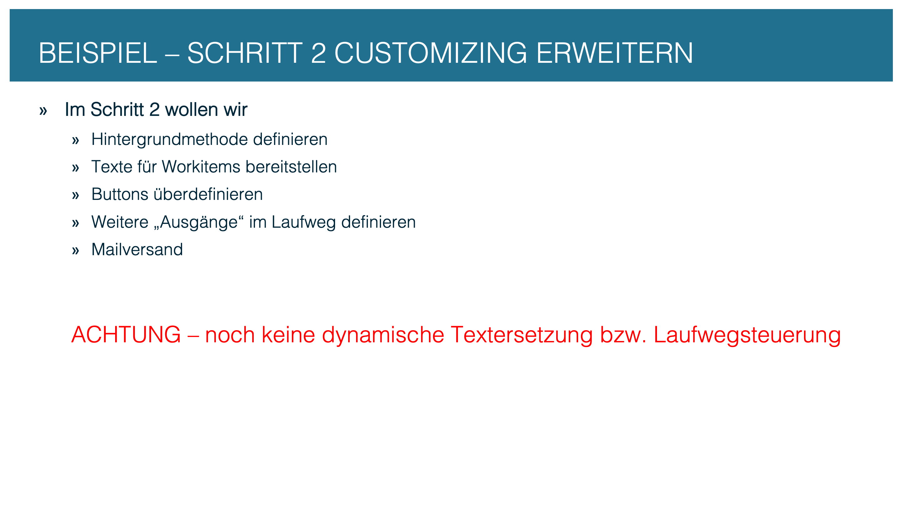
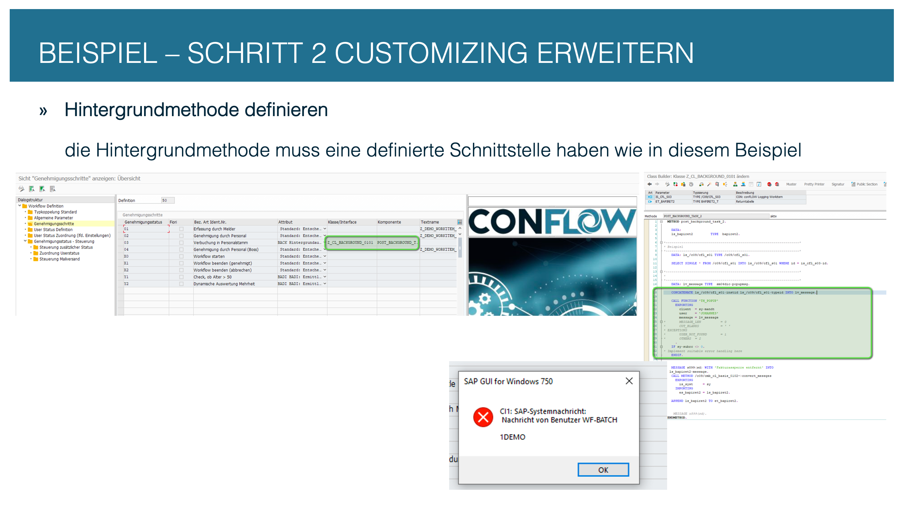
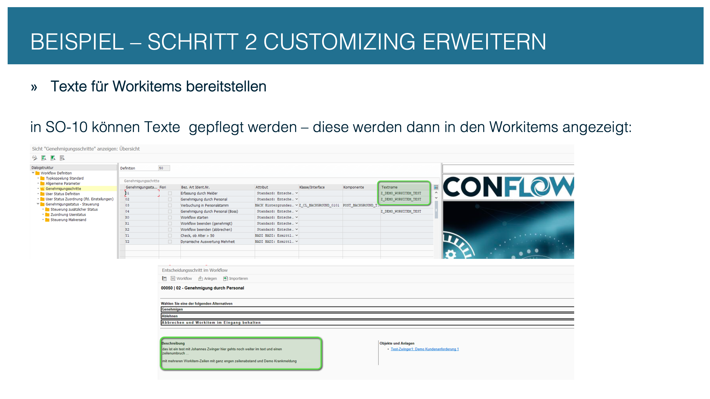
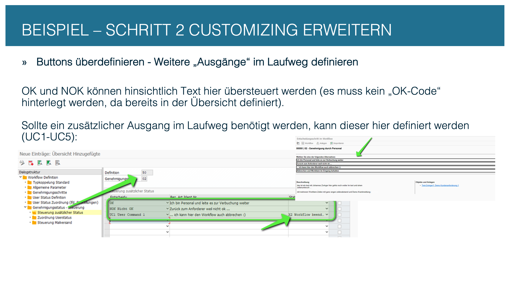
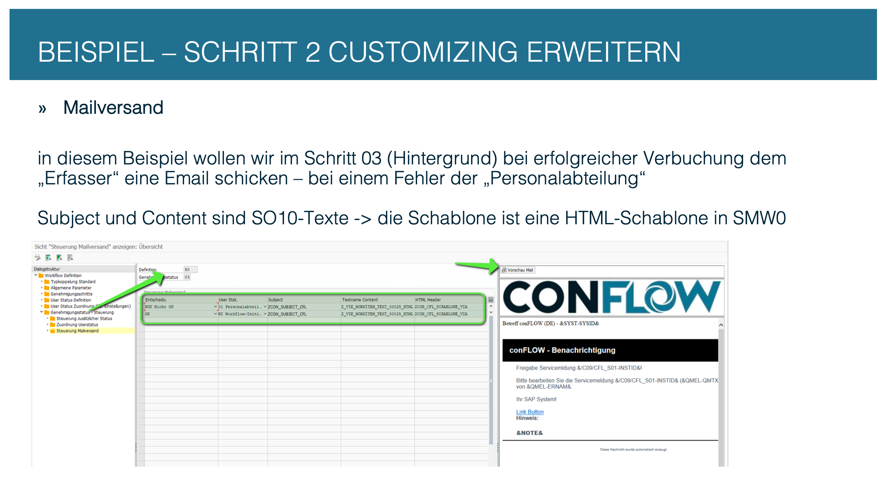

# Step 2: Extend the Customizing

The workflow basically runs now. In this step you refine the Customizing: background steps get functionality, work items get a description, buttons get labels, and email notification is set up.

---

## 2.1 Extended configuration at a glance

<figure><figcaption>
Overview: what the extended Customizing adds
</figcaption></figure>

---

## 2.2 Assign a method to background steps

A background step (type `BACK_BATCH`) automatically executes a static ABAP method. The method is maintained in Customizing — class and method name in `/C09/CFL_C01`, fields `clsname` and `cmpname`.

The method must have a fixed signature:

| Parameter | Direction | Type | Meaning |
| --- | --- | --- | --- |
| `IS_CFL_S03` | Importing | `/C09/CFL_S03` | Current work item row |
| `ET_BAPIRET2` | Exporting | `BAPIRET2_T` | Messages (an E/A message makes the outcome NOK) |
| `EV_DECISION_KEY` | Exporting | `SWR_DECIKEY` | Decision (determines the next step) |

Alternatively `clsname` holds a class implementing the interface `/C09/CFL_IF_BACKGROUND_0101` (`cmpname` stays empty). A background step without any method (attribute `BACK_BATCH`, a template in `/C09/CFL_C08` required) can decide through a condition in `/C09/CFL_C09`, see [Technical documentation, section 7](../../technical-documentation.md#7-background-steps).


**Always set `EV_DECISION_KEY`.** Without a return value the framework sets the outcome to `OK` — but to `NOK` if there is an error message in `ET_BAPIRET2`. This reserves `NOK` on background steps for the error case; business results belong on `UC1`–`UC5`.


<figure><figcaption>
Background step: class and method in Customizing
</figcaption></figure>

---

## 2.3 Work item description with SO10 texts

So that the agent understands what the work item is about, maintain **SO10 texts** in Customizing. The text names are stored in `/C09/CFL_C01`, field `tdname`. In the SO10 text, values appear as **placeholders** of the form `&STRUCTURE-FIELD&`. If a `TEMPLATE` is maintained in the general parameters (`/C09/CFL_C08`), its document fields are available without code. The short work item description comes from the step text (`/C09/CFL_C01T`); placeholders of the form `§{field}` are allowed there.

<figure><figcaption>
SO10 texts: work item description with placeholders
</figcaption></figure>

---

## 2.4 Decision options and button labels

In addition to `OK` and `NOK` you can create up to five further decision options (`UC1` to `UC5`). They are configured in the node **Control additional status** (`/C09/CFL_C09`) — one row per step.

The **labels** of the buttons (including `OK` and `NOK`) are maintained in the text table `/C09/CFL_C09T`. Without an entry there, the work item shows the standard texts of the SAP task.


**Button control:** Set `nodisplay = 'X'` in `/C09/CFL_C09` to hide a button for a specific step. This lets you, for example, forbid cancellation on the first step while allowing it on the escalation step. In the same node you color the button (`nature` = `P` green, `N` red) and make a comment mandatory (`comment_req`) — in SAP GUI and in Fiori.


<figure><figcaption>
Decision options UC1–UC5 and their labels
</figcaption></figure>

---

## 2.5 Configure email notification

In the node **Control mail setting** (`/C09/CFL_C07`) you configure who receives an email at which step. The mail contents are maintained as SO10 texts and use the same placeholders of the form `&STRUCTURE-FIELD&`.

With `TEMPLATE` in `/C09/CFL_C08` the document fields are available without code; additional data sources come from the BAdI method `GET_DATASOURCE_MAIL` (see [Step 3](step-3-badi-implementation.md)).

<figure><figcaption>
Email notification: recipients and SO10 texts per step
</figcaption></figure>
