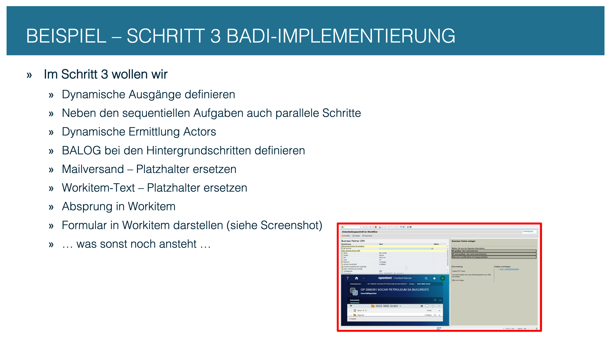
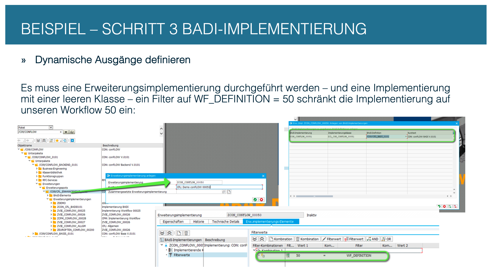
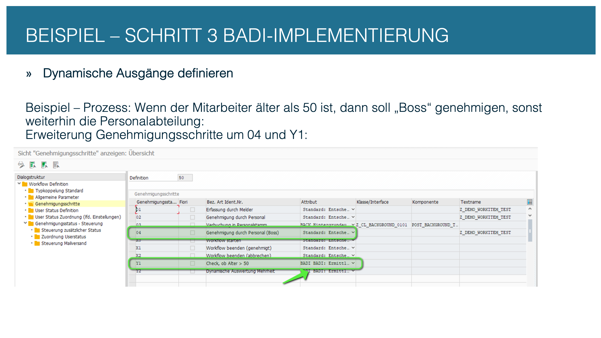
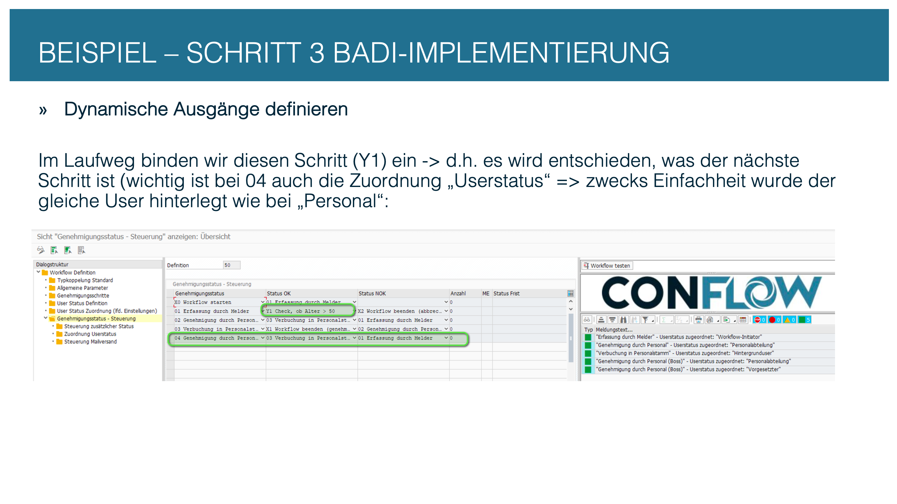
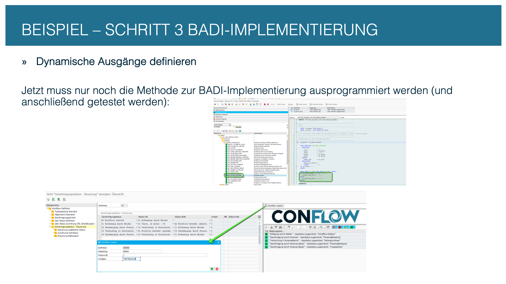
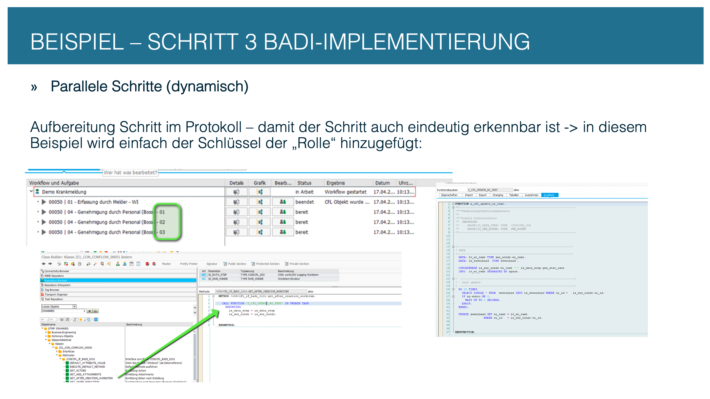
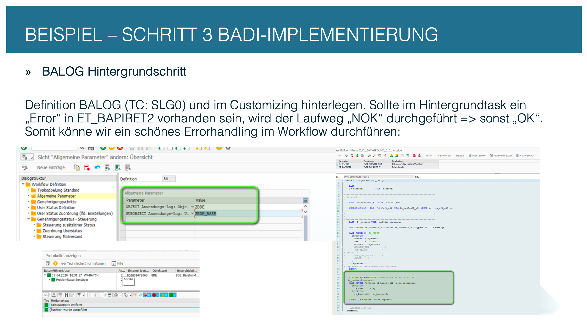
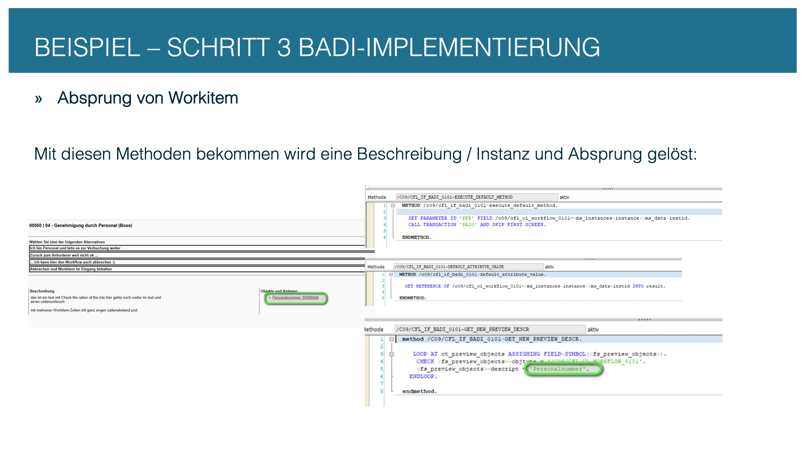

# Step 3: BAdI implementation

The Customizing defines the process flow — the BAdI class fills it with business logic. In this step you create the BAdI implementation and implement the most important hooks.

---

## 3.1 Overview

If a workflow needs logic the Customizing does not cover, it gets **at most one** BAdI class that implements the interface `/C09/CFL_IF_BADI_0101`. The class is restricted to the workflow number by a **filter** — so it only applies to "its" workflow.


**All hooks always exist.** The interface defines numerous methods. Leave the ones you don't need empty — just do nothing in them. The framework does not check whether a hook contains code.


<figure><figcaption><p>The BAdI class: one class per workflow definition</p></figcaption></figure>

---

## 3.2 Create the enhancement implementation

In transaction **SE80** (or ADT), create an enhancement implementation for the enhancement spot `/C09/CFL_ES_BADI_0101`. The decisive step is the **filter**: set `wf_definition = '<your number>'` so that the class only applies to your workflow.

<figure><figcaption><p>SE80: BAdI implementation with a filter on the workflow number</p></figcaption></figure>

---

## 3.3 Dynamic step determination

If the next step should not come from Customizing (`/C09/CFL_C02`) but be calculated at runtime, set the type of the approval step to **"BADI"**. conFLOW then calls the BAdI method `GET_STATUS_DYNAMIC` and expects the next `gen_stat` as the return value.


**Caution:** When `GET_STATUS_DYNAMIC` is active, the transitions in `/C09/CFL_C02` are **ignored** for this step. All routing logic then lives in ABAP code. Use this mode only if the decision really has to be dynamic. If the process branches on document values (e.g. amount above a limit), use a background step without a method and a condition in `/C09/CFL_C09` (column `BEDINGUNG`) instead — the branch then stays visible in Customizing.


<figure><figcaption><p>Type "BADI": dynamic step determination at runtime</p></figcaption></figure>

<figure><figcaption><p>GET_STATUS_DYNAMIC: the code determines the next step</p></figcaption></figure>

<figure><figcaption><p>Example: branching based on document data</p></figcaption></figure>

---

## 3.4 Parallel steps

For a parallel step, assign **several agent keys** (`gen_stat_user`) to one approval step in Customizing. conFLOW creates a work item for each, and the workflow waits until all of them have decided.


**Veto, first decision or majority** are now set on the step without code, with the column *Decision rule* in Approval steps. Details: [Technical documentation, parallel agent paths](../../technical-documentation.md#parallel-agent-paths). The BAdI is only needed for rules of your own.


<figure><figcaption><p>Parallel processing: several agent keys per step</p></figcaption></figure>

<figure><figcaption><p>Parallel work items in the inbox</p></figcaption></figure>

<figure><figcaption><p>Merging the parallel results</p></figcaption></figure>

---

## 3.5 Dynamic agent determination with GET\_ACTORS

If `user_badi = 'X'` is set in Customizing (`/C09/CFL_C03`), conFLOW calls the BAdI method `GET_ACTORS`. There you determine the agent at runtime — for example based on organizational unit or document data. A PFCG role needs no BAdI (column `AGR_NAME` in `/C09/CFL_C03`), and neither does excluding agents (column `EXCLUDE`, special value `WF_APPROVERS`).


**Mind the format:** actor strings must always start with an object type prefix: `US` for user, `S` for position. A bare user name without a prefix is ignored.


<figure><figcaption><p>GET_ACTORS: determine agents dynamically at runtime</p></figcaption></figure>

---

## 3.6 Application log (SLG1)

Messages from background steps (`ET_BAPIRET2`) are logged automatically in the **application log** (SLG1). You configure object and subobject in the node **General parameters** (`/C09/CFL_C08`). The messages can be evaluated there without a custom Z table.

<figure><figcaption><p>Messages in the application log (SLG1)</p></figcaption></figure>

---

## 3.7 Replace mail placeholders with GET\_DATASOURCE\_MAIL

The SO10 texts for email notifications contain placeholders of the form `&STRUCTURE-FIELD&`. With `TEMPLATE` in `/C09/CFL_C08` the framework already supplies the document fields. The method `GET_DATASOURCE_MAIL` supplies additional data sources — such as values from the conFLOW container or the log.


**Template:** [Reference: GET_DATASOURCE_MAIL](../badi-reference/mail/get-datasource-mail.md).


<figure><figcaption><p>Replace placeholders in SO10 texts dynamically</p></figcaption></figure>

---

## 3.8 Navigate to the business object with EXECUTE\_DEFAULT\_METHOD

When the agent wants to jump from the work item to the business object (double-click in SAP GUI), conFLOW calls the method `EXECUTE_DEFAULT_METHOD`. There you set the parameter and call the transaction:

```abap
SET PARAMETER ID 'AUN' FIELD lv_belegnr.
CALL TRANSACTION 'VA03' AND SKIP FIRST SCREEN.
```

If a `TEMPLATE` is maintained in `/C09/CFL_C08` and an object label (`OBJTEXT`) on the workflow definition, conFLOW opens the document on double-click itself. You only need this method for a different target.

<figure><figcaption><p>Navigation from the work item to the SAP transaction</p></figcaption></figure>

---

## 3.9 Further options

The BAdI interface offers many more hooks — for most workflows the ones shown above are enough. Further hooks such as `GET_AFTER_EXECUTION_WORKITEM`, `GET_BEFORE_DECISION_WORKITEM` or `GET_OBJECT_INFO` enable follow-up logic, button control and adjustments to the Fiori display. Much of this is now a setting: button colour and mandatory comment (`/C09/CFL_C09`, `NATURE`/`COMMENT_REQ`), object label (`OBJTEXT` of the workflow definition), priority (`PRIO` on the approval step).

<figure><figcaption><p>Further BAdI hooks for special requirements</p></figcaption></figure>
