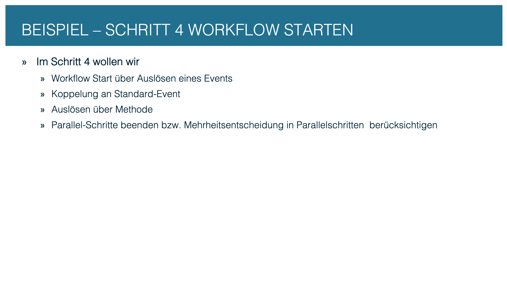
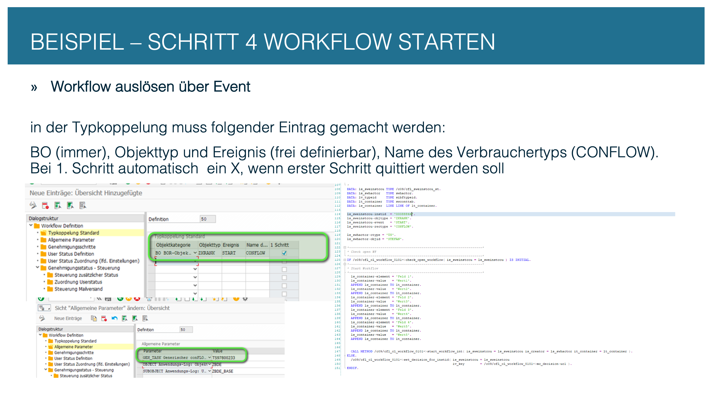
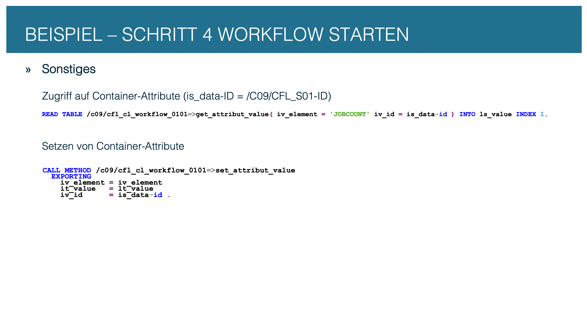
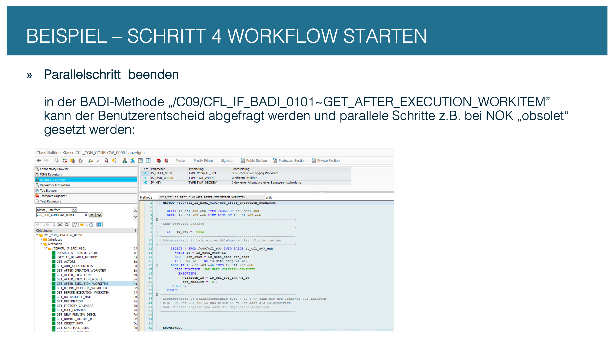
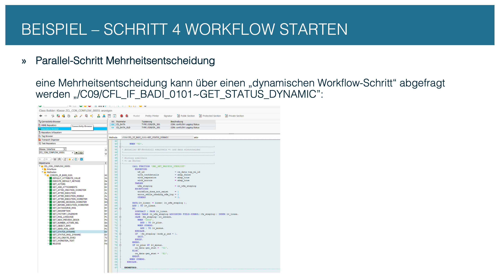

# Step 4: Start and test the workflow

The workflow is configured and the BAdI class is implemented. In this last step you set up the trigger, fill the container with business data and test the whole process.

---

## 4.1 Overview

<figure><figcaption><p>From the trigger to the running workflow</p></figcaption></figure>

---

## 4.2 Trigger options

There are several ways to trigger a conFLOW workflow. The choice depends on the use case:

| Option | When to use | How |
| --- | --- | --- |
| **Event + type linkage** | Automatically on an event of the business object | Maintain the type linkage in `/C09/CFL_C10`, see [Technical documentation, section 3](../../technical-documentation.md#3-starting-a-workflow) |
| **Report / program** | Demos, tests, manual triggering | Call `start_workflow_int( )` directly |
| **Application BAdI** | Automatically when a document changes | Check and start in the save exit of the application object |
| **Status management** | Automatically on a status change | SAP status management (BSVW) raises a BOR event, the SWETYPV type linkage triggers the workflow |


**Protection against multiple starts:** `start_workflow_int( )` does **not** check whether a workflow is already running for the same object. Call `check_open_workflow( )` first — otherwise parallel instances are created for the same document.


<figure><figcaption><p>Option A: start the workflow from a report or program</p></figcaption></figure>

<figure><figcaption><p>Option B: start the workflow from an application BAdI</p></figcaption></figure>

<figure><figcaption><p>Option C: workflow via status management and BOR event</p></figcaption></figure>

---

## 4.3 Fill the container

The **conFLOW container** (`/C09/CFL_S04`) stores any business data as key-value pairs. It is written with the framework methods:

```abap
" write a value
/c09/cfl_cl_workflow_0101=>set_attribut_value(
  iv_element = 'BELEGNR'
  iv_id      = ls_cfl_s03-id
  it_value   = VALUE #( ( lv_belegnr ) ) ).

" read a value
DATA(lt_val) = /c09/cfl_cl_workflow_0101=>get_attribut_value(
                 iv_element = 'BELEGNR'
                 iv_id      = ls_cfl_s03-id ).
```


**Best practice:** put attribute names as constants into a separate class `ZCL_CFL_CONST_<nnnnn>`. This class is shared by the BAdI class, the background steps and, if applicable, the UI — one source for all attribute names.


<figure><figcaption><p>SET_ATTRIBUT_VALUE and GET_ATTRIBUT_VALUE: the conFLOW container</p></figcaption></figure>

---

## 4.4 Follow-up logic for parallel steps

With parallel work items, several agents decide at the same time. **What should count is set on the step:** column *Decision rule* in Approval steps — veto, first decision or majority. See [Parallel agent paths](../../technical-documentation.md#parallel-agent-paths). The BAdI variants below are only needed for rules none of the settings covers, such as weighted votes.

The BAdI method `GET_AFTER_EXECUTION_WORKITEM` is called after **each individual** decision. It receives three things:

| Parameter | Content |
| --- | --- |
| `IS_DATA_STEP` | the step, including the instance `ID`, `GEN_STAT` and its own `WI_ID` |
| `IS_SWR_WIHDR` | the work item header |
| `IV_KEY` | the outcome chosen (`0001` = OK, `0002` = NOK, `0003`–`0007` = `UC1`–`UC5`) |

### Option A: the first rejection ends the parallel step

The most common case. If one agent rejects, the other agents' work items should disappear — otherwise someone works on a case that has already been decided.

```abap
" GET_AFTER_EXECUTION_WORKITEM
IF iv_key = '0002'.                              " on NOK only

  SELECT * FROM /c09/cfl_s03 INTO TABLE lt_cfl_s03
    WHERE id       = is_data_step-id
      AND gen_stat = is_data_step-gen_stat       " this step only
      AND wi_id   NE is_data_step-wi_id.         " not your own

  LOOP AT lt_cfl_s03 INTO ls_cfl_s03.
    CALL FUNCTION 'SAP_WAPI_WORKITEM_COMPLETE'
      EXPORTING
        workitem_id = ls_cfl_s03-wi_id
        set_obsolet = 'X'.
  ENDLOOP.

ENDIF.
```

<figure><figcaption><p>Ending a parallel step: set the remaining work items to obsolete on NOK (labels in German)</p></figcaption></figure>


**The same thing exists ready-made** — `/C09/CFL_CL_HELPER_0101=>SET_WORKITEM_OBSOLET( is_data_step = is_data_step )`. One difference matters: the helper clears **all** open dialog work items of the entire workflow, the coding above only those of the **same step**. If your process has parallel work items in several steps at once, use the narrower variant. And in both cases: **the `COMMIT WORK` is up to the caller**, otherwise the work items stay open, with no error message.


### Option B: the majority decides

If the first vote should not count but the result of all of them, you need a **collecting step**: a `Y` step after the parallel step that all outcomes point to. The votes are counted there — in `GET_STATUS_DYNAMIC`, which is called precisely for `Y` steps.

Counting is done on the workflow log. It is read from the end backwards until the start of the parallel block is reached:

```abap
" GET_STATUS_DYNAMIC, at the collecting step
CALL FUNCTION 'SWL_GET_PROCESS_STEPLIST'
  EXPORTING
    wf_id          = cs_data-top_wi_id
    with_expansion = abap_true
    with_errors    = abap_true
  TABLES
    wfm_steplog    = lt_wfm_steplog.

lv_lines = lines( lt_wfm_steplog ) + 1.

DO.
  SUBTRACT 1 FROM lv_lines.
  READ TABLE lt_wfm_steplog ASSIGNING <fs_steplog> INDEX lv_lines.

  CASE <fs_steplog>-rc_intern.
    WHEN '0003'.  ADD 1 TO lv_plus.              " approval
    WHEN OTHERS.  ADD 1 TO lv_minus.
  ENDCASE.

  IF <fs_steplog>-node_p_ind = 1.                " start of the parallel block
    EXIT.
  ENDIF.
ENDDO.

IF lv_plus GT lv_minus.
  cs_data-gen_stat = '01'.                       " majority in favor
ELSE.
  cs_data-gen_stat = 'X1'.                       " majority against
ENDIF.
```

<figure><figcaption><p>Majority decision: counting in the collecting step through GET_STATUS_DYNAMIC (labels in German)</p></figcaption></figure>


**Which result code counts as approval depends on your workflow.** In the example it is `0003`. Check this against your own log instead of copying the value — and remember that `node_p_ind` is the exit condition: without it you count the whole workflow, not just the parallel block.


There is a third way when the point is not majorities but different answers: give the agents their own outcomes through `UC1`–`UC5` and evaluate those in a subsequent step.

## 4.5 Checklist: first test

Before the workflow goes live, check the following:

| Check | Where |
| --- | --- |
| Workflow instance was created | `/C09/CFL_S01`: a row with your `wf_definition` and `instid` |
| Work items were created | `/C09/CFL_S03`: rows with the `id` from `S01` |
| Agent is correct | SWIA: open the work item, check the agent |
| Container is filled | `/C09/CFL_S04`: attributes with the `id` from `S01` |
| Decision works | Open the work item in SBWP or Fiori My Inbox and decide |
| Next step is correct | After the decision: next step in `S01-gen_stat` |
| Workflow ends | `S01-wf_end = 'X'` after the last step |


**The workflow runs.** From here on, the process is functionally complete. Further refinements — better texts, differentiated agent determination, Fiori display, a conMOBILE app — are enhancements, not prerequisites.

