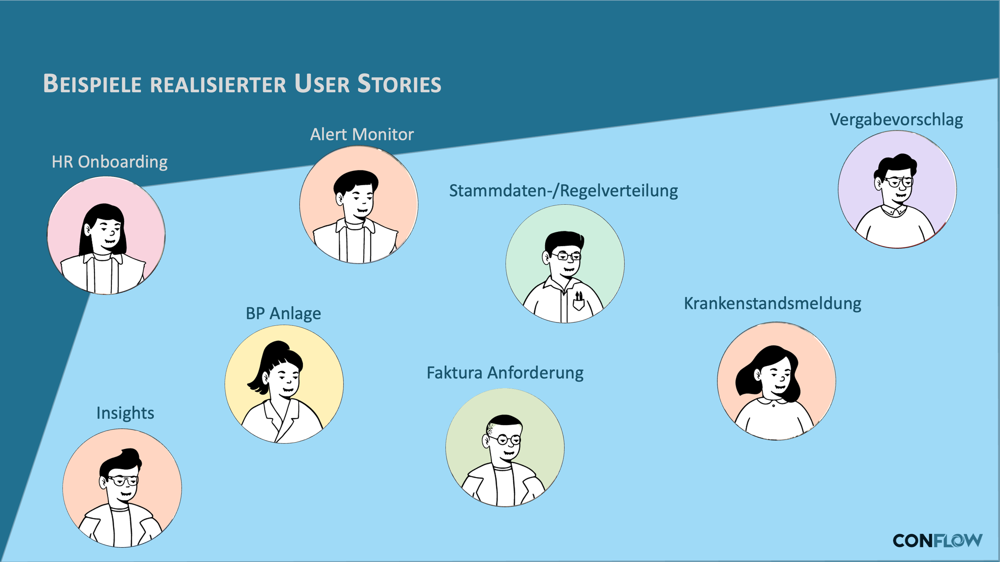

# Examples of implemented workflows

The following examples show which processes can be implemented with conFLOW. What they have in common: the workflow was defined in Customizing tables, with special business logic in a BAdI class where needed — without the Workflow Builder and without SAP workflow development.

The examples come from different SAP modules and cover different patterns: simple two-step approvals, multi-level approvals with escalation, background steps with automatic processing, and parallel agent paths.


**Each example shows two views:** the business user story (what should the process achieve?) and the technical workflow (what does the process flow look like in conFLOW?). Together they show the strength of conFLOW: a process that is easy to understand from the business side and stays simple technically.


<figure><figcaption>
Overview of the implemented workflow scenarios
</figcaption></figure>

| Module | Workflow | Pattern |
| --- | --- | --- |
| **HR** | [Sick leave notification](hr-sick-leave.md) | Notification by the employee, processing by the HR department |
| **HR** | [Onboarding](hr-onboarding.md) | Multi-step onboarding process with several participants |
| **SD** | [Billing request](sd-billing-request.md) | Approval workflow in sales |
| **SD** | [Business partner synchronization](sd-business-partner-sync.md) | Automated synchronization with background steps |
| **BC** | [Alert monitor](bc-alert-monitor.md) | System monitoring with escalation |
| **BC** | [Master data distribution](bc-master-data-distribution.md) | Distribution and approval of master data across systems |
| **CA** | [Award proposal](ca-award-proposal.md) | Multi-level approval in purchasing |
