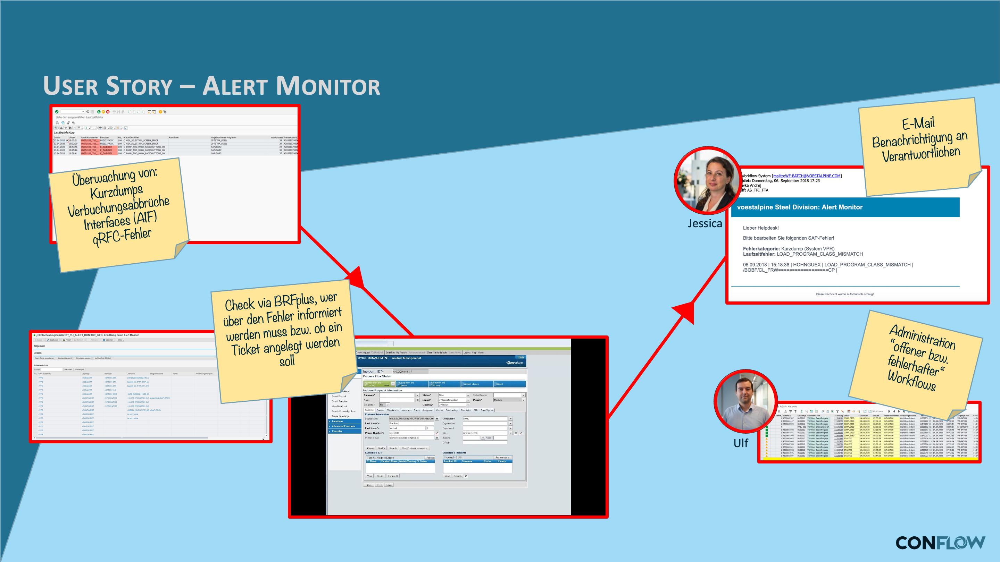

# BC alert monitor

## The requirement

System alerts in SAP Basis operations must reliably reach the right agent and be handled in a traceable way. Classic alerts end up in the CCMS alert monitor or in an email — both without acknowledgment, without escalation and without a documented processing path.

## What conFLOW does here

The workflow receives an alert and creates a work item for the responsible Basis administrator. If the alert is not processed within a defined **deadline**, conFLOW automatically escalates to the next level. The deadline is maintained in Customizing, not in code — changing it requires no transport.

The result is a complete audit trail: when the alert was raised, who processed it when, and how it was decided. This matters both for regulated environments and for analyzing recurring problems.

### User story

**Daily routine:** **Ulf** is an SAP administrator and monitors all SAP instances. With several hundred users working with the system every day, directly or through interfaces, terminations and interface errors happen regularly. But Ulf has set up rules so that the responsible process owners always receive a notification and then have to act.

**conFLOW for alerts:** well-placed automatic triggers at critical points start workflows that notify the right people in a targeted way — and also provide a good overview of the application areas where particularly many problems occur.

### Workflow

<figure><figcaption>
Process flow with deadline and escalation (diagram labels in German)
</figcaption></figure>
