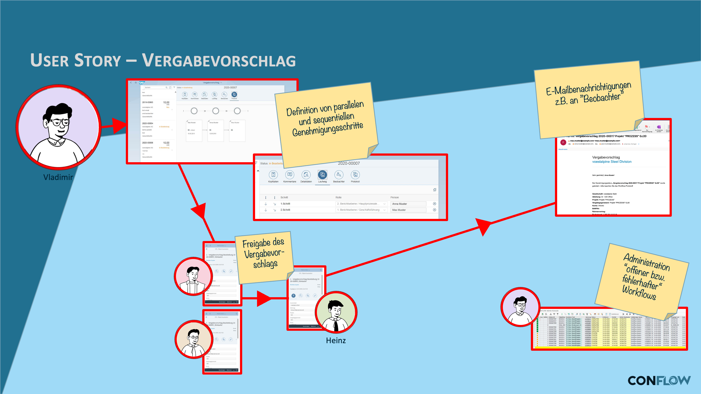

# CA award proposal

## The requirement

An award proposal in purchasing goes through several approval levels before it becomes an order. Depending on volume, material group or supplier, different approvers are responsible. The process must be traceable and meet deadlines.

## What conFLOW does here

The workflow models a **multi-level approval**: the award proposal first goes to the business department, then to the head of purchasing, and if a value limit is exceeded, to management. Each level has its own agents and can offer its own decision options — besides approve and reject also query or forward.

The value limit is a rule in Customizing. Agent determination can use a PFCG role or be dynamic: the BAdI method `GET_ACTORS` determines the right approver at runtime, depending on document data such as purchasing organization, material group or order value.

conFLOW offers up to **seven decision options** per step (`OK`, `NOK`, `UC1` to `UC5`). This allows differentiated decisions — such as "approve", "reject", "approve with conditions", "back to creator" or "forward to next level".

### User story

**Daily routine:** buyer **Vladimir** is responsible for obtaining supplier quotations for requests from various business departments. He prepares them and decides on the award. If the costs exceed EUR 100,000, however, the award has to be approved by several departments through a defined process flow.

**conFLOW for the award proposal:** **Vladimir** enters the quotations from 5 suppliers for an S/4HANA brownfield conversion in the SAP app "Award proposal". The IT team has already chosen a supplier, and Vladimir has already negotiated the final offer. He builds the process flow interactively. At this order of magnitude, the award proposal has to be approved by the entire first reporting level and then by the CFO, **Heinz**.

### Workflow

<figure><figcaption>
Process flow with several approval levels (diagram labels in German)
</figcaption></figure>
