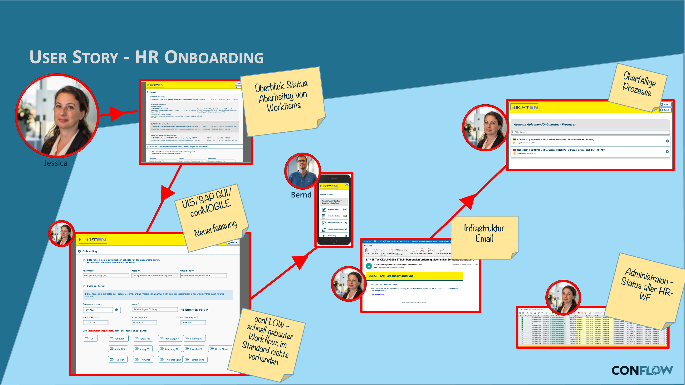

# HR onboarding

## The requirement

A new employee joins the company. Before they can work productively, several departments have to complete tasks: IT provides access, HR takes care of contracts and briefings, the business department prepares the workplace. Without a structured process, tasks get lost, responsibilities are unclear, and the new employee waits.

## What conFLOW does here

The onboarding workflow coordinates several participants through a defined process. Each step creates a work item for the right agent — the process only continues once a step is completed. The system automatically documents who did what and when.

conFLOW can also model **parallel steps** here: tasks that lie with different departments at the same time run in parallel, and the workflow waits until all of them are done before moving on to the next step.

### User story

**Daily routine:** HR employee **Jessica** works every day on hiring and leaving employees. Many actions run in parallel and take several days, with decision-makers from different departments involved. She often loses track, and handing over to her deputy is difficult.

**conFLOW for HR workflows:** **Jessica** comes into the office in the morning and her pending tasks give her a good overview of how far her deputy got yesterday. A new buyer has been confirmed for purchasing, so she fills in the onboarding form right away and starts the workflow towards infrastructure, HR and the head of purchasing, Bernd.

At the end of the day, **Jessica** always checks which workflows are overdue. Since she does not use the automatic deadline monitoring, she follows up with the decision-makers personally.

### Workflow

<figure><figcaption>
Process flow with parallel steps (diagram labels in German)
</figcaption></figure>
