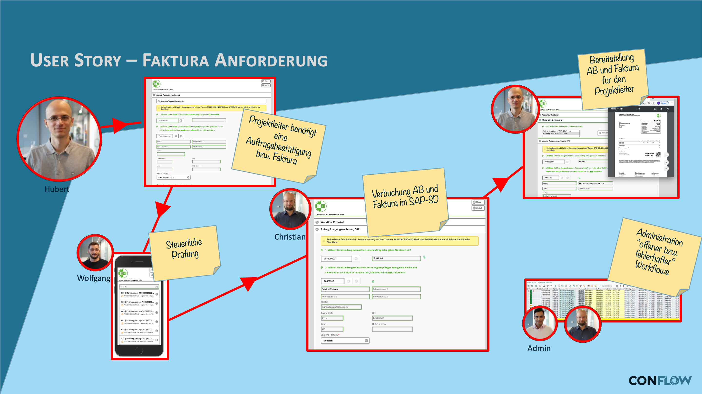

# SD billing request

## The requirement

Before an invoice goes to the customer, it must be approved — especially for special conditions, credit memos or deviations from the standard. Without a defined approval process this happens by shouting across the office or not at all, and incorrect invoices are only noticed by the customer.

## What conFLOW does here

The workflow ensures that every relevant billing request reaches the right approver. The agent sees the key document data on the work item and decides: approve or reject. On rejection, the request goes back to the creator; on approval, the billing document is created or flagged for creation.

The approver can be assigned in Customizing or determined dynamically by the BAdI method `GET_ACTORS` — for example depending on sales area, document type or amount.

### User story

**Daily routine:** biologist **Hubert** is a project manager and analyzes water samples on behalf of various organizations. On the commercial side, he accompanies the process from order to billing. Because of the complex tax situation, pricing is hardly manageable for him manually, so he has to rely on the sales back office.

**conFLOW for billing:** **Hubert** has taken water samples at Lake Constance. Now he sits in the inn by the lake and enters various sample data into a dedicated app. Then he starts an SAP app and requests an invoice. The workflow determines the correct VAT rate using predefined rules. If anything is unclear, **Wolfgang** in the tax competence center receives the workflow. **Christian** from the sales back office finally checks everything once more. If everything is fine, Hubert receives the order confirmation and the invoice in his inbox — which is very convenient for him anyway, because he always has access to all projects there.

### Workflow

<figure><figcaption>
Process flow of the approval workflow (diagram labels in German)
</figcaption></figure>
