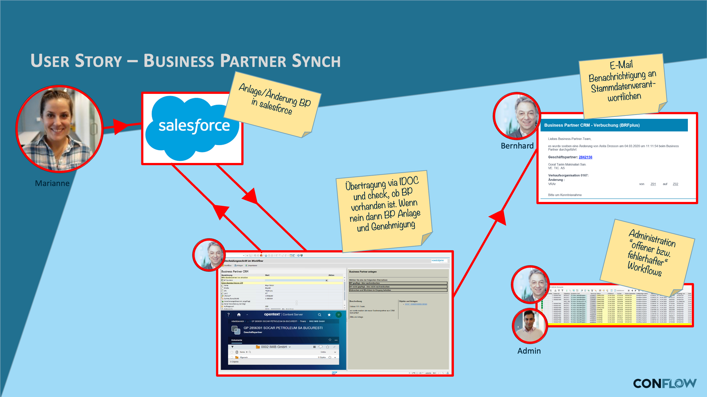

# SD business partner synchronization

## The requirement

Business partner master data must be kept in sync between systems or organizational units. Changes to a business partner — a new address, changed bank details, a new contact person — must be checked and transferred to the target systems.

## What conFLOW does here

The workflow detects relevant changes to the business partner and automatically starts a synchronization process. **Background steps** can take over the actual technical synchronization, while a dialog step only steps in when a manual check or decision is needed — for example in case of conflicts or incomplete data.

This example shows a pattern that is typical for conFLOW: the **standard case runs through automatically** (background steps, no work item in any inbox), and **only the exception creates work** for a person.

### User story

**Daily routine:** **Marianne** is a sales representative and works in the field at trade shows. She transfers information about prospects into the CRM during breaks or at the end of the day. It is important to capture person and company correctly right away, so that documents, photos and notes are filed with the right reference. Since many duplicates were created in the past, this check is now taken off her hands.

**conFLOW for the business partner:** **Marianne** works with Salesforce and captures information about a request from a new prospect at the trade show booth. Neither the person nor the company exists yet, so a workflow is started directly from Salesforce. Since none is found in the ERP either, the business partner is created and the master data owner **Bernhard** is notified. Thanks to the immediate master data synchronization between Salesforce and SAP, Marianne can enter further information in Salesforce only moments later.

### Workflow

<figure><figcaption>
Process flow with background steps (diagram labels in German)
</figcaption></figure>
