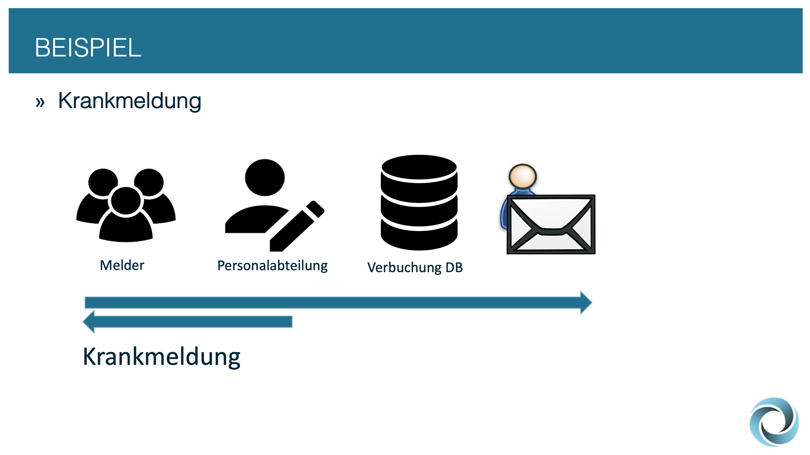

# 🎇 Beispiel Workflow Krankmeldung

| Rolle             | Aufgabe                     |
| ----------------- | --------------------------- |
| Melder            | Meldet eine Krankmeldung    |
| Personalabteilung | Bearbeitet die Krankmeldung |
|                   |                             |

<figure><figcaption></figcaption></figure>

