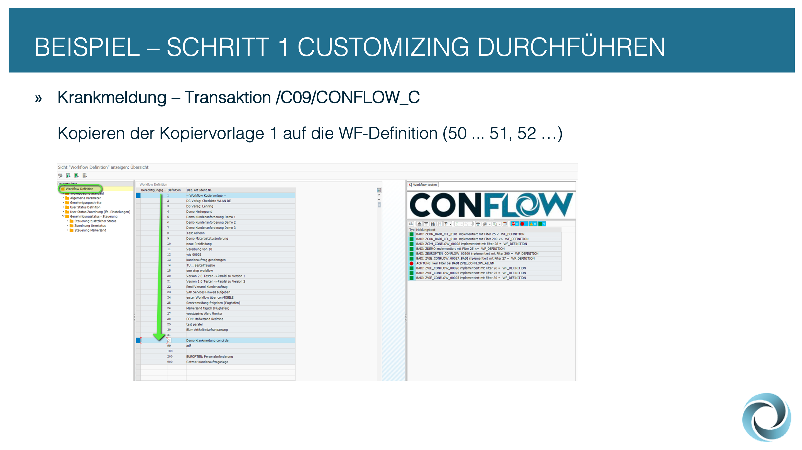
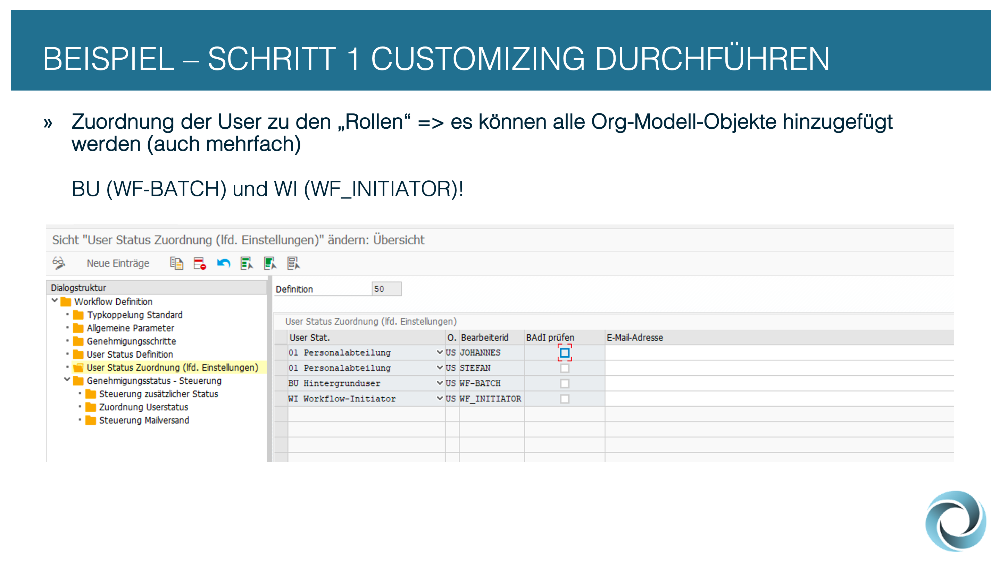
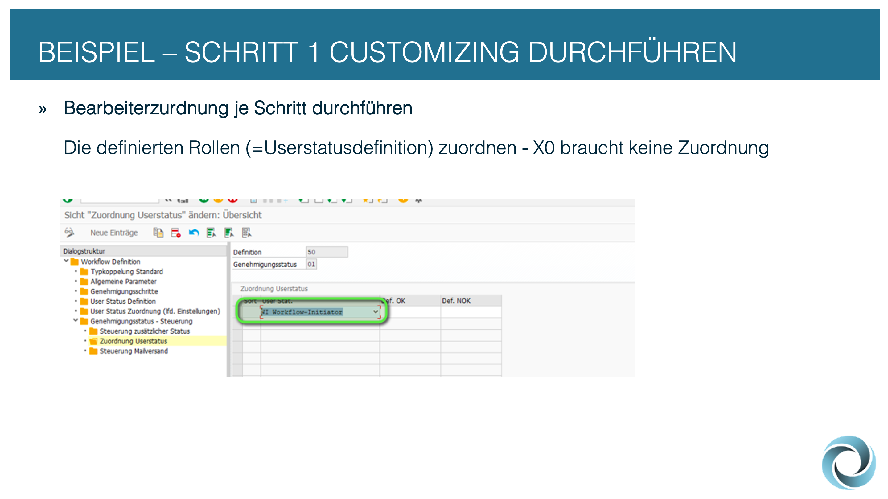
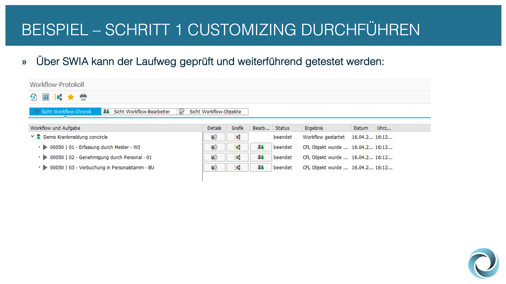

# 📝 Schritt 1: Customizing


**/C09/CONFLOW\_C** - mit dieser Transaktion gelangen Sie in das Workflow-Customizing. Legen Sie eine neue Workflow-Definition an bzw. kopieren Sie die Kopiervorlage 1:


<figure><figcaption></figcaption></figure>


Legen Sie anschließend die Schritte 01-03 im Unterordner "Genehmigungsschritte" an. für den Schritt 03 bitte die Auswahl "BACK\_BATCH" verwenden (alte Version: "BACK")\
\
Die Schritte X0-X2 sind als "best practice" gedacht - der erste Schritt muss jedoch X0 sein und ein Schritt, der den Workflow beendet mit X beginnen.


<figure><figcaption></figcaption></figure>


Unter "User Status Definition" werden die "Rollen" definiert. Für die Krankmeldung wird noch der Status "01 Personalabteilung" benötigt. BU bzw. WI definieren den Hintergrunduser bzw. Workflow-Initiator ("best practice").


<figure><figcaption></figcaption></figure>


Der tatsächliche Bearbeiter wird unter "User Status Zuordnung" gepflegt. Hier erfolgt die Zuordnung der "Rolle" zu den Usern bzw. Objekten im SAP-Organisationsmanagement.


<figure><figcaption></figcaption></figure>


Durch die Aneinanderreihung der Genehmigungsschritte wird der Laufweg definiert. in dieser Übersicht werden die Ausgänge OK/NOK definiert - es gibt jedoch ein weiteres Customizing, um bis zu 5 weitere Entscheidungsalternativen zu pflegen.


<figure><figcaption></figcaption></figure>


Um die Verknüpfung von Genehmigungsschritt und tatsächlichen Bearbeiter zu machen, muss unter "Zuordnung Userstatus" noch der relevante Userstatus hinterlegt werden. Hier können auch mehrere Userstatus hinterlegt werden, was bedeutet, dass es zu einem parallelen Workflow-Schritt kommt.


<figure><figcaption></figcaption></figure>


Ab diesem Zeitpunkt ist der Wokflow lauffähig und kann getestet werden.


<figure><figcaption></figcaption></figure>


Über die SAP Transaktion SWIA kann der Laufweg bzw. Workflow geprüft und getestet werden.


<figure><figcaption></figcaption></figure>

