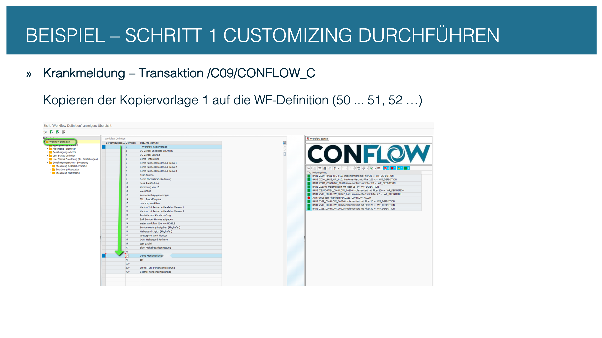
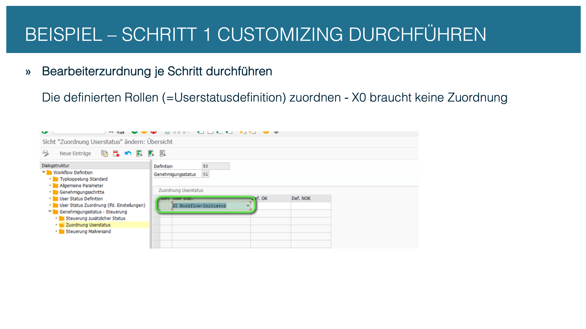
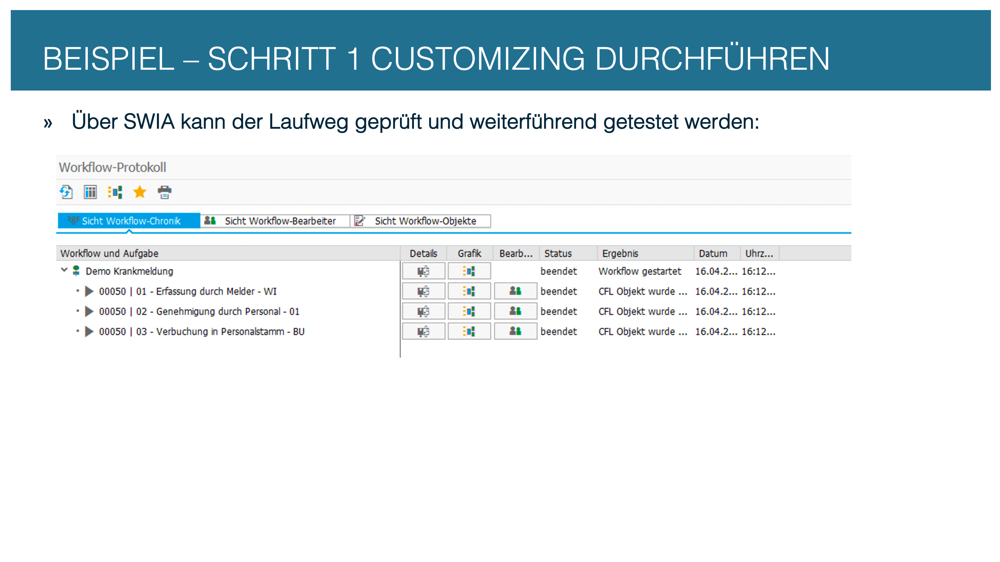

# Schritt 1: Customizing anlegen

In diesem Schritt legen wir die Workflow-Definition an und konfigurieren den Laufweg. Am Ende ist der Workflow technisch lauffaehig und kann getestet werden -- die fachliche Logik folgt in den weiteren Schritten.

---

## 1.1 Workflow-Definition anlegen

Einstieg ueber die Transaktion **`/C09/CONFLOW_C`**. Legen Sie eine neue Workflow-Definition an oder kopieren Sie die Kopiervorlage 1. Die Workflow-Nummer (z.B. `00100`) identifiziert den Prozess im gesamten System -- sie taucht im Customizing, in der BAdI-Klasse und im Reporting wieder auf.


**Tipp:** Pruefen Sie vor dem Anlegen, ob die gewuenschte Nummer in `/C09/CFL_C06` noch frei ist. Jede Nummer darf im System nur einmal vorkommen.


<figure><figcaption>
Transaktion /C09/CONFLOW_C: Workflow-Definition anlegen
</figcaption></figure>

---

## 1.2 Genehmigungsschritte definieren

Im Unterordner **"Genehmigungsschritte"** legen Sie die einzelnen Schritte an. Jeder Schritt hat einen Status-Code (`gen_stat`) und einen Typ:

| Typ | Status-Code | Bedeutung |
| --- | --- | --- |
| Start | `X0` | **Pflicht** -- der erste Schritt jedes Workflows |
| Dialog | `01`, `02`, ... | Erzeugt ein Workitem in der Inbox des Bearbeiters |
| Hintergrund | `B1`, `B2`, ... | Automatische Verarbeitung, kein Workitem |
| Ende | `X1`, `X2`, ... | Beendet den Workflow. Jeder Status mit `X` am Anfang ist ein Endstatus |


**Best Practice:** Fuer Hintergrundschritte den Typ `BACK_BATCH` verwenden (nicht `BACK`). `BACK_BATCH` laeuft als technischer User `WF-BATCH`, `BACK` im Dialog des aktuellen Benutzers. Die aeltere Variante `BACK` ist weiterhin moeglich, erzeugt aber ein Workitem in der Inbox.


<figure><figcaption>
Genehmigungsschritte: Typ, Status-Code und Reihenfolge
</figcaption></figure>

---

## 1.3 Bearbeiter-Rollen definieren

Unter **"User Status Definition"** legen Sie die Rollen an, die in diesem Workflow vorkommen. Eine Rolle ist ein Bearbeiter-Key (`gen_stat_user`) mit einer Bezeichnung.

Zwei Rollen sind als Best Practice vordefiniert:

| Key | Bedeutung |
| --- | --- |
| `BU` | Hintergrund-User (`WF-BATCH`) fuer automatische Schritte |
| `WI` | Workflow-Initiator -- der Benutzer, der den Workflow gestartet hat |

Weitere Rollen legen Sie je nach Prozess an, z.B. `01` fuer die Personalabteilung.

<figure><figcaption>
Bearbeiter-Rollen (gen_stat_user) definieren
</figcaption></figure>

---

## 1.4 Bearbeiter zuordnen

Unter **"User Status Zuordnung"** ordnen Sie den Rollen die tatsaechlichen Bearbeiter zu. Die Zuordnung erfolgt ueber SAP-Organisationsobjekte:

| Objekttyp (`otype`) | Beispiel | Bedeutung |
| --- | --- | --- |
| `US` | `MEIER` | Einzelner SAP-Benutzer |
| `S` | `50000123` | SAP-Planstelle |
| `AC` | `Z_HR_ADMIN` | PFCG-Rolle |
| `US` | `WF-BATCH` | Technischer Hintergrund-User |
| `US` | `WF_INITIATOR` | Workflow-Initiator (dynamisch) |


**Dynamische Bearbeiterfindung:** Setzen Sie `user_badi = 'X'` in `/C09/CFL_C03`, um die Aufloesung an die BAdI-Methode `GET_ACTORS` zu delegieren. Dann ermittelt der ABAP-Code den Bearbeiter zur Laufzeit, z.B. abhaengig von Belegdaten. Siehe [Schritt 3: BAdI-Implementierung](schritt-3-badi-implementierung.md).


<figure><figcaption>
Zuordnung der Rollen zu SAP-Benutzern oder Organisationsobjekten
</figcaption></figure>

---

## 1.5 Laufweg definieren

Unter **"Genehmigungsschritte"** (Uebergangstabelle) definieren Sie, welcher Schritt auf welchen folgt. Jeder Schritt hat zwei Standard-Ausgaenge:

| Ausgang | Feld in `/C09/CFL_C02` | Bedeutung |
| --- | --- | --- |
| OK | `gen_stat_ok` | Genehmigt / Weiter |
| NOK | `gen_stat_nok` | Abgelehnt / Zurueck |

Zusaetzlich koennen bis zu fuenf weitere Entscheidungsalternativen (`UC1`-`UC5`) definiert werden -- das folgt in [Schritt 2](schritt-2-customizing-erweitern.md).


**Pflicht:** Der Einstieg ist immer `X0`. In der Uebergangstabelle muss eine Zeile `gen_stat = 'X0'` mit dem ersten Dialogschritt in `gen_stat_ok` stehen. `X0` ist die einzige Status-Konstante, die das Framework hart kodiert erwartet.


<figure><figcaption>
Uebergangstabelle: Schritt fuer Schritt durch den Prozess
</figcaption></figure>

---

## 1.6 Schritt und Bearbeiter verknuepfen

Unter **"Zuordnung Userstatus"** (`/C09/CFL_C05`) verknuepfen Sie jeden Genehmigungsschritt mit der Rolle, die ihn bearbeiten soll.


**Parallele Schritte:** Ordnen Sie einem Genehmigungsschritt **mehrere** Bearbeiter-Keys zu. conFLOW erzeugt dann fuer jeden ein eigenes Workitem, und der Workflow wartet, bis alle entschieden haben.


<figure><figcaption>
Verknuepfung: welche Rolle bearbeitet welchen Schritt
</figcaption></figure>

---

## 1.7 Ergebnis: der Workflow ist lauffaehig

Ab diesem Punkt ist der Workflow technisch lauffaehig. Das Customizing definiert: welche Schritte es gibt, wer sie bearbeitet, in welcher Reihenfolge und mit welchen Ausgaengen. Ein Start (z.B. ueber einen Testreport oder SWIA) erzeugt eine Workflow-Instanz und das erste Workitem.

<figure><figcaption>
Ergebnis: der Workflow laeuft und erzeugt Workitems
</figcaption></figure>

---

## 1.8 Testen mit SWIA

Ueber die SAP-Transaktion **`SWIA`** koennen Sie den Workflow pruefen und testen. SWIA zeigt den aktuellen Zustand jeder Workflow-Instanz: welcher Schritt ist aktiv, welcher Bearbeiter ist zugeordnet, und wie sieht die Historie aus.


**Empfehlung:** Testen Sie den Workflow nach jedem Customizing-Schritt in SWIA. So finden Sie Konfigurationsfehler (fehlender Bearbeiter, fehlender Uebergang) sofort und nicht erst bei der BAdI-Implementierung.


<figure><figcaption>
Transaktion SWIA: Workflow-Instanzen pruefen und testen
</figcaption></figure>
