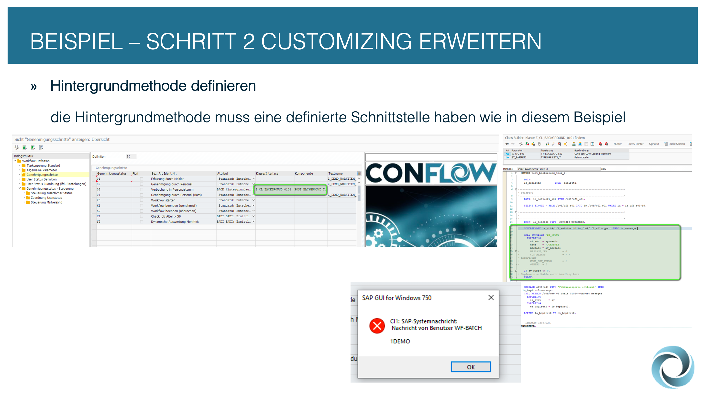

# 📝 Schritt 2: Customizing erweitern


Die nächsten Punkte zeigen, wie wir im Customizing noch diverse Einstellungen vornehmen können, um die Anforderungen an den eigenen Workflow gerecht zu werden.


<figure><figcaption></figcaption></figure>


Damit ein Hintergrundschritt auch eine Funktion hat, muss eine statische Methode hinterlegt werden. Ein Beispiel zeigt die Methode /C09/CFL\_CL\_BADI\_0101=>POST\_BACKGROUND\_TASK\_2.


<figure><figcaption></figcaption></figure>


Damit bei den Entscheidungsaufgaben auch eine Beschreibung eingeblendet wird, können SO10-Texte im Customizing hinterlegt werden.


<figure><figcaption></figcaption></figure>


Zusätzlich können weitere Entscheidungsalternativen im Customizing hinterlegt und auch die Bezeichnungen für diese Ausgänge/Buttons gepflegt werden.


<figure><figcaption></figcaption></figure>


Im Unterordner "Mailversand" können die Empfänger der Emails hinterlegt werden und der entsprechende Content als SO10-Texte.


<figure><figcaption></figcaption></figure>

