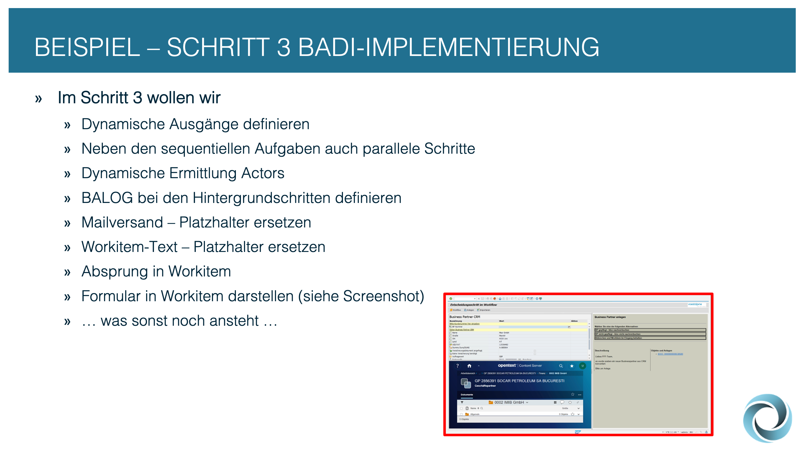
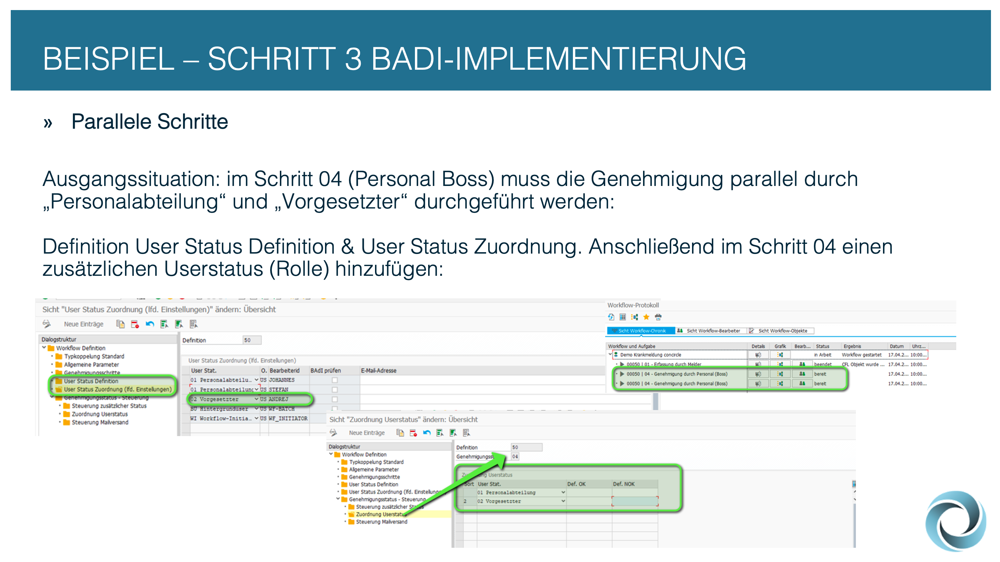
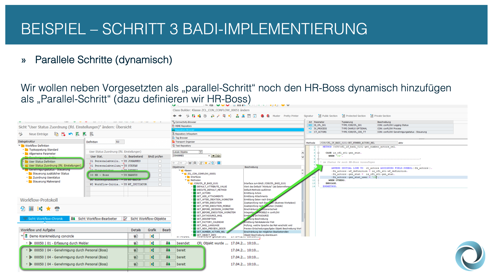
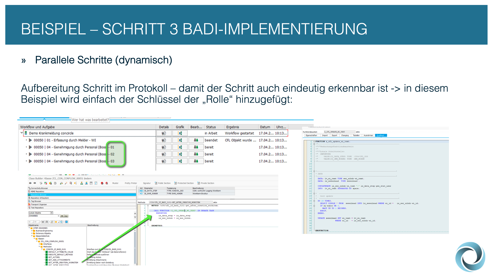
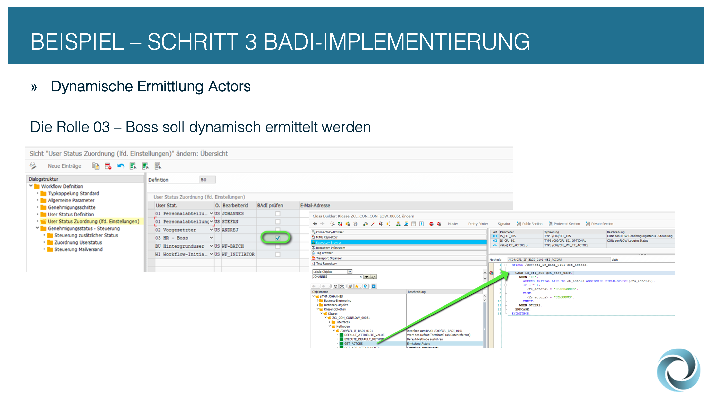
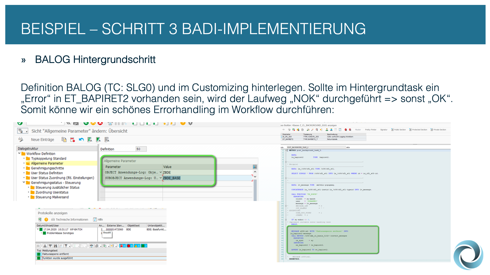
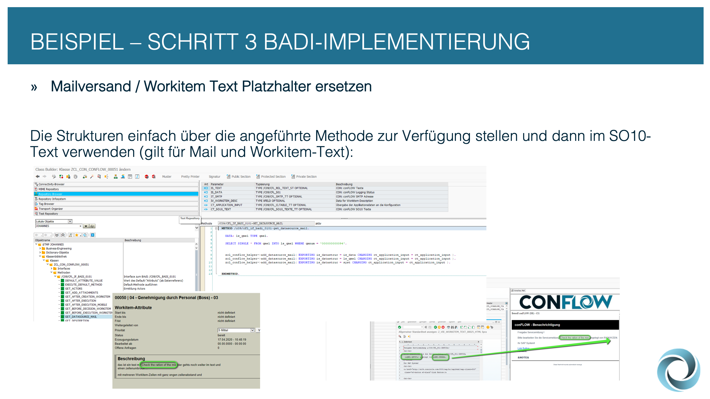
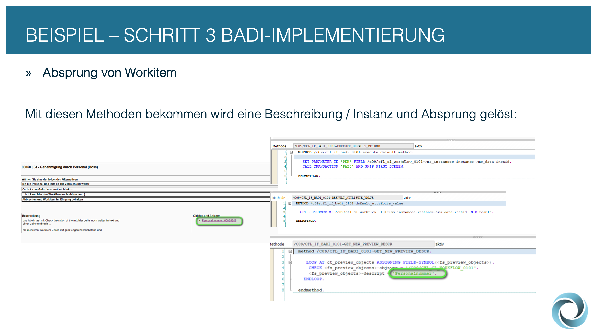
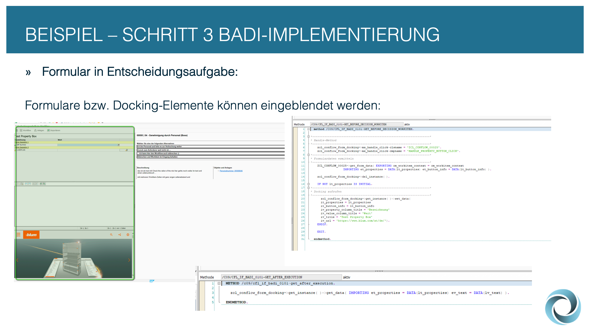

# 📝 Schritt 3: BADI Implementierung


Die nächsten Punkte zeigen, wie man mittels BADI Implementierung Anforderungen sehr einfach lösen kann.


<figure><figcaption></figcaption></figure>


Über die Transaktion SE80 muss eine Erweiterungsimplementierung durchgeführt werden und diese mittels Filter auf die jeweilige Workflow-Definition eingeschränkt werden.


<figure><figcaption></figcaption></figure>


Ein Schritt kann auch dynamisch abhängig von diversen Eigenschaften ermittelt werden. Um dies zu ermöglichen, muss einfach im Genehmigungsschritt "BADI" ausgewählt werden.


<figure><figcaption></figcaption></figure>

<figure><figcaption></figcaption></figure>

<figure><figcaption></figcaption></figure>


Um einen parallelen Schritt zu definieren, müssen die parallel laufenden Userstatus zum Genehmigungsschritt hinterlegt werden.


<figure><figcaption></figcaption></figure>

<figure><figcaption></figcaption></figure>

<figure><figcaption></figcaption></figure>


Um den Bearbeiter einer Rolle dynamisch zu ermitteln, kann die Methode "GET\_ACTORS" in der BADI-Implementierung verwendet werden.


<figure><figcaption></figcaption></figure>


Die Meldungen aus den Hintergrundschritten werden in einen BALOG fortgeschrieben und können dementsprechend ausgewertet und abgefragt werden.


<figure><figcaption></figcaption></figure>


Die dynamische Ersetzung der Platzhalter in den SO10-Texten erfolgt in der Methode GET\_DATASOURCE\_MAIL der BADI-Implementierung. In der ausgelieferten Klasse /C09/CFL\_CL\_BADI\_0101 findet man dazu auch ein Beispiel.


<figure><figcaption></figcaption></figure>


Der Absprung aus dem Workitem in das gewünschte SAP-Objekt erfolgt in der Methode EXECUTE\_DEFAULT\_METHOD der BADI-Implementierung.


<figure><figcaption></figcaption></figure>


Es gibt noch diverse Möglichkeiten, um die Entscheidungsaufgabe im SAP-GUI zu erweitern.


<figure><figcaption></figcaption></figure>

