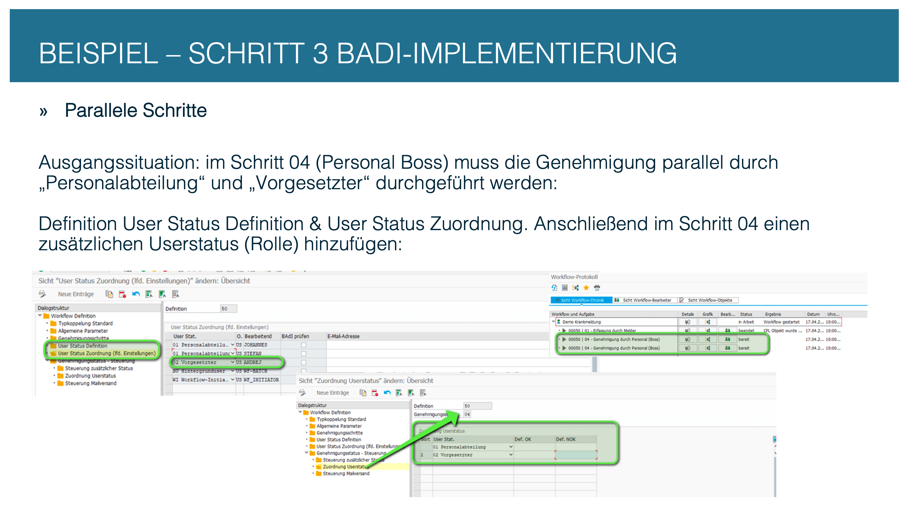
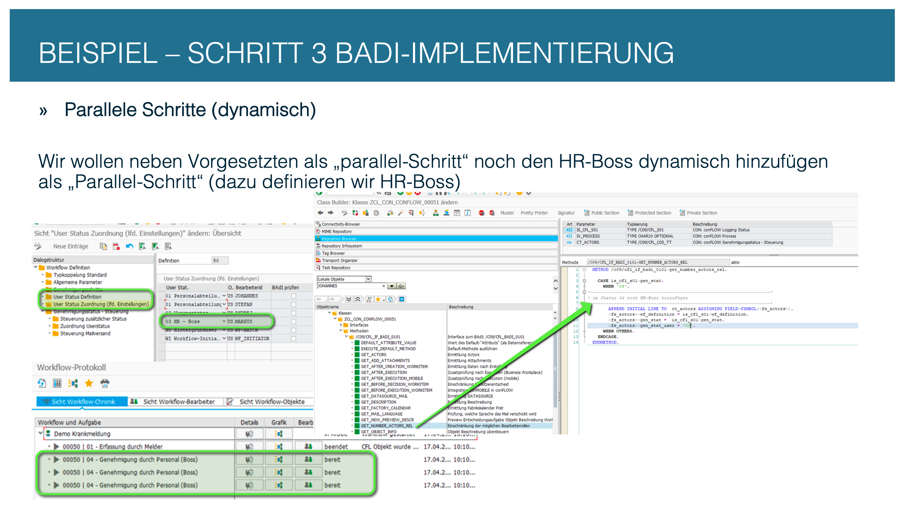
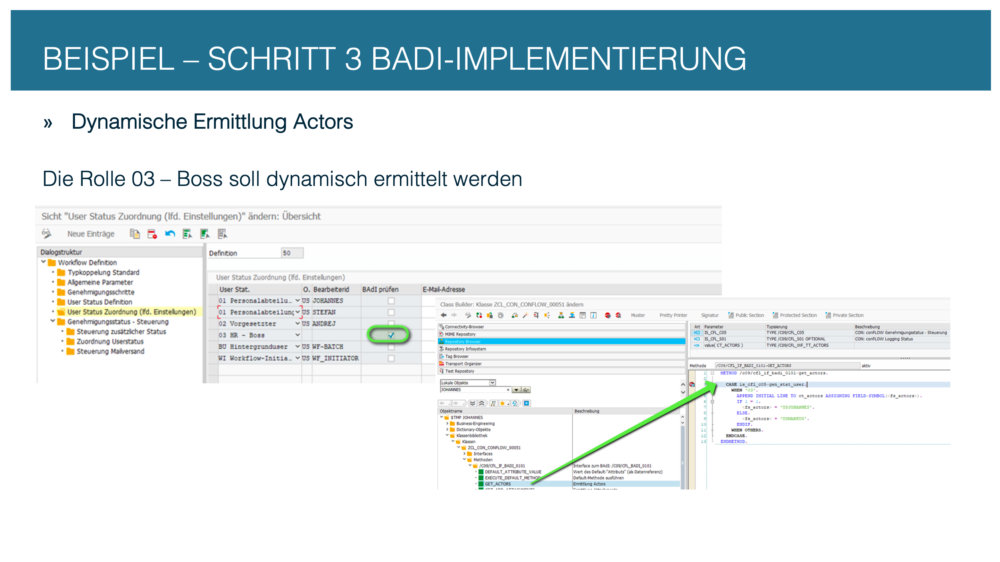
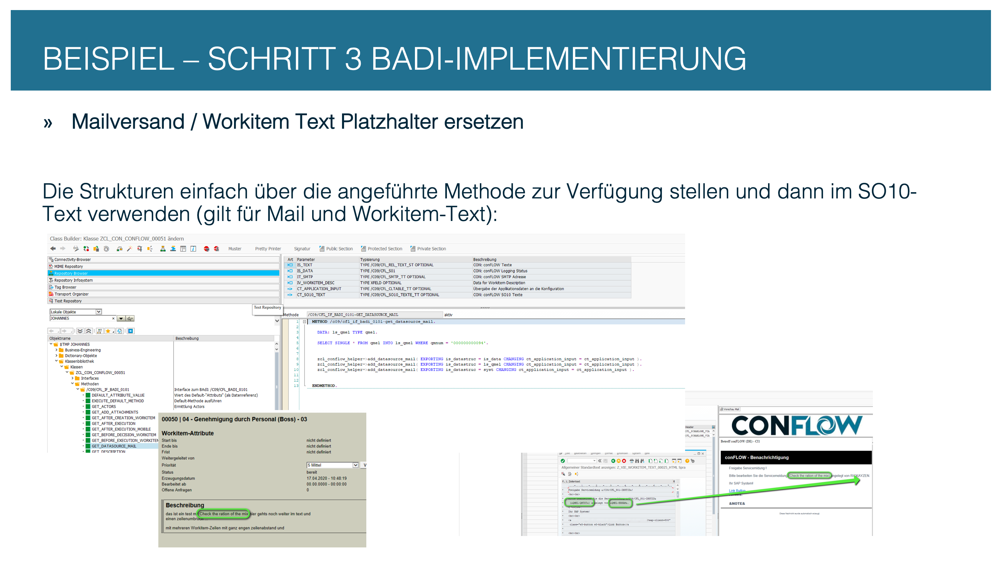
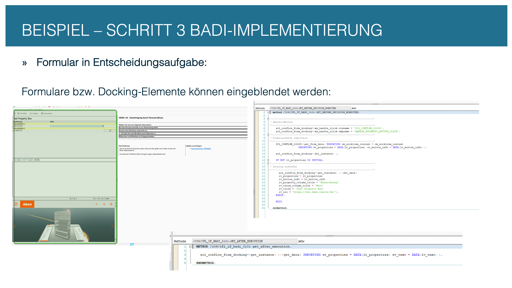

# Schritt 3: BAdI-Implementierung

Das Customizing definiert den Laufweg -- die BAdI-Klasse fuellt ihn mit fachlicher Logik. In diesem Schritt legen wir die BAdI-Implementierung an und implementieren die wichtigsten Hooks.

---

## 3.1 Ueberblick

Jeder conFLOW-Workflow hat genau eine BAdI-Klasse, die das Interface `/C09/CFL_IF_BADI_0101` implementiert. Die Klasse wird ueber einen **Filter** auf die Workflow-Nummer eingeschraenkt -- damit greift sie nur fuer "ihren" Workflow.


**Alle Hooks existieren immer.** Das Interface definiert zahlreiche Methoden. Nicht benoetigte bleiben leer -- keine leere Implementierung schreiben, einfach nichts tun. Das Framework prueft nicht, ob ein Hook Code enthaelt.


<figure><figcaption><p>Die BAdI-Klasse: eine Klasse je Workflow-Definition</p></figcaption></figure>

---

## 3.2 Erweiterungsimplementierung anlegen

Ueber die Transaktion **SE80** (oder ADT) legen Sie eine Erweiterungsimplementierung zum Enhancement Spot `/C09/CFL_ES_BADI_0101` an. Der entscheidende Schritt ist der **Filter**: setzen Sie `wf_definition = '<Ihre Nummer>'`, damit die Klasse nur fuer Ihren Workflow greift.

<figure><figcaption><p>SE80: BAdI-Implementierung mit Filter auf die Workflow-Nummer</p></figcaption></figure>

---

## 3.3 Dynamische Schrittermittlung

Soll der naechste Schritt nicht aus dem Customizing (`/C09/CFL_C02`) kommen, sondern zur Laufzeit berechnet werden, setzen Sie im Genehmigungsschritt den Typ auf **"BADI"**. conFLOW ruft dann die BAdI-Methode `GET_STATUS_DYNAMIC` und erwartet den naechsten `gen_stat` als Rueckgabe.


**Vorsicht:** Wenn `GET_STATUS_DYNAMIC` aktiv ist, werden die Uebergaenge in `/C09/CFL_C02` fuer diesen Schritt **ignoriert**. Die gesamte Routing-Logik liegt dann im ABAP-Code. Verwenden Sie diesen Modus nur, wenn die Entscheidung tatsaechlich dynamisch sein muss.


<figure><figcaption><p>Typ "BADI": dynamische Schrittermittlung zur Laufzeit</p></figcaption></figure>

<figure><figcaption><p>GET_STATUS_DYNAMIC: Code bestimmt den naechsten Schritt</p></figcaption></figure>

<figure><figcaption><p>Beispiel: Verzweigung abhaengig von Belegdaten</p></figcaption></figure>

---

## 3.4 Parallele Schritte

Fuer einen parallelen Schritt ordnen Sie im Customizing **mehrere Bearbeiter-Keys** (`gen_stat_user`) zu einem Genehmigungsschritt zu. conFLOW erzeugt fuer jeden ein Workitem, und der Workflow wartet, bis alle entschieden haben.

<figure><figcaption><p>Parallele Bearbeitung: mehrere Bearbeiter-Keys je Schritt</p></figcaption></figure>

<figure><figcaption><p>Parallele Workitems in der Inbox</p></figcaption></figure>

<figure><figcaption><p>Zusammenfuehrung der parallelen Ergebnisse</p></figcaption></figure>

---

## 3.5 Dynamische Bearbeiterfindung mit GET\_ACTORS

Ist im Customizing (`/C09/CFL_C03`) `user_badi = 'X'` gesetzt, ruft conFLOW die BAdI-Methode `GET_ACTORS`. Dort ermitteln Sie den Bearbeiter zur Laufzeit -- z.B. abhaengig von Organisationseinheit, Belegdaten oder einer PFCG-Rolle.


**Format beachten:** Die Actor-Strings muessen immer mit einem Objekttyp-Praefix beginnen: `US` fuer Benutzer, `S` fuer Planstelle, `AC` fuer Rolle. Ein blanker Username ohne Praefix wird ignoriert.


<figure><figcaption><p>GET_ACTORS: Bearbeiter dynamisch zur Laufzeit ermitteln</p></figcaption></figure>

---

## 3.6 Anwendungslog (SLG1)

Meldungen aus Hintergrundschritten (`ET_BAPIRET2`) werden automatisch im **Anwendungslog** (SLG1) protokolliert. Das Objekt und Subobjekt konfigurieren Sie in `/C09/CFL_C08`. Die Meldungen sind dort auswertbar, ohne dass eine eigene Z-Tabelle noetig ist.

<figure><figcaption><p>Meldungen im Anwendungslog (SLG1)</p></figcaption></figure>

---

## 3.7 Mail-Platzhalter ersetzen mit GET\_DATASOURCE\_MAIL

Die SO10-Texte fuer den Mailversand enthalten Platzhalter (`§{...}`). Die Methode `GET_DATASOURCE_MAIL` liefert die Ersetzungswerte -- typischerweise Belegdaten, die aus dem conFLOW-Container oder aus dem SAP-Beleg gelesen werden.


**Referenzimplementierung:** Die Standardklasse `/C09/CFL_CL_BADI_0101` enthaelt ein Beispiel fuer `GET_DATASOURCE_MAIL`, das als Ausgangspunkt dienen kann.


<figure><figcaption><p>Platzhalter in SO10-Texten dynamisch ersetzen</p></figcaption></figure>

---

## 3.8 Absprung ins Belegobjekt mit EXECUTE\_DEFAULT\_METHOD

Wenn der Bearbeiter aus dem Workitem ins Belegobjekt springen will (Doppelklick im SAP-GUI), ruft conFLOW die Methode `EXECUTE_DEFAULT_METHOD`. Dort setzen Sie den Parameter und rufen die Transaktion auf:

```abap
SET PARAMETER ID 'ANR' FIELD lv_belegnr.
CALL TRANSACTION 'VA03' AND SKIP FIRST SCREEN.
```

<figure><figcaption><p>Absprung aus dem Workitem in die SAP-Transaktion</p></figcaption></figure>

---

## 3.9 Weitere Moeglichkeiten

Das BAdI-Interface bietet zahlreiche weitere Hooks -- fuer die meisten Workflows reichen die oben gezeigten. Weitere Hooks wie `GET_AFTER_EXECUTION_WORKITEM`, `GET_BEFORE_DECISION_WORKITEM` oder `GET_OBJECT_INFO` ermoeglichen Nachlauflogik, Button-Steuerung und die Anpassung der Fiori-Darstellung.

<figure><figcaption><p>Weitere BAdI-Hooks fuer spezielle Anforderungen</p></figcaption></figure>
