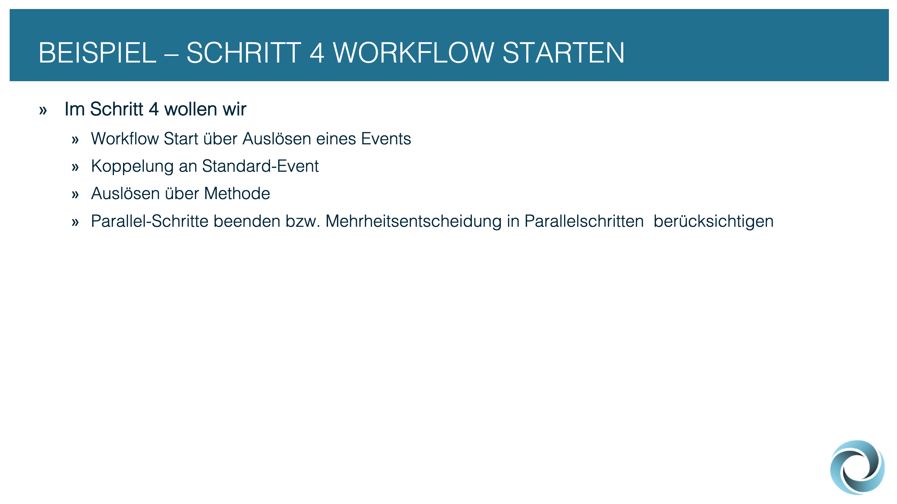
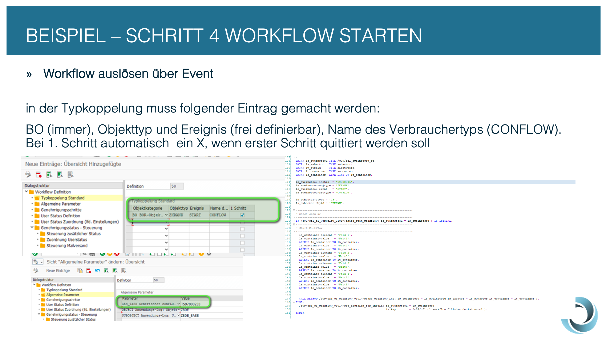
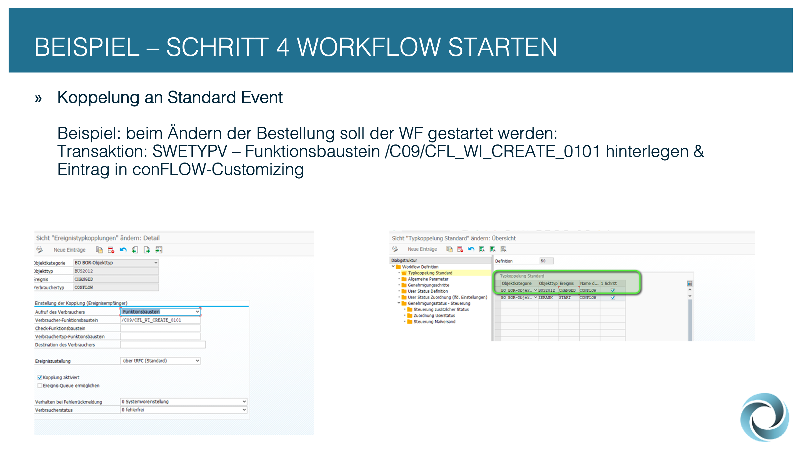
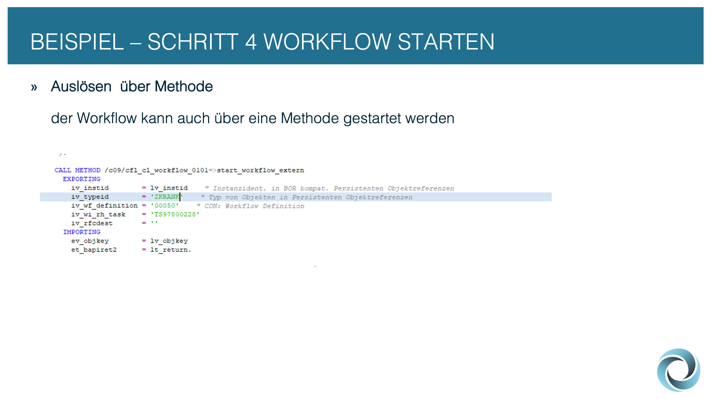
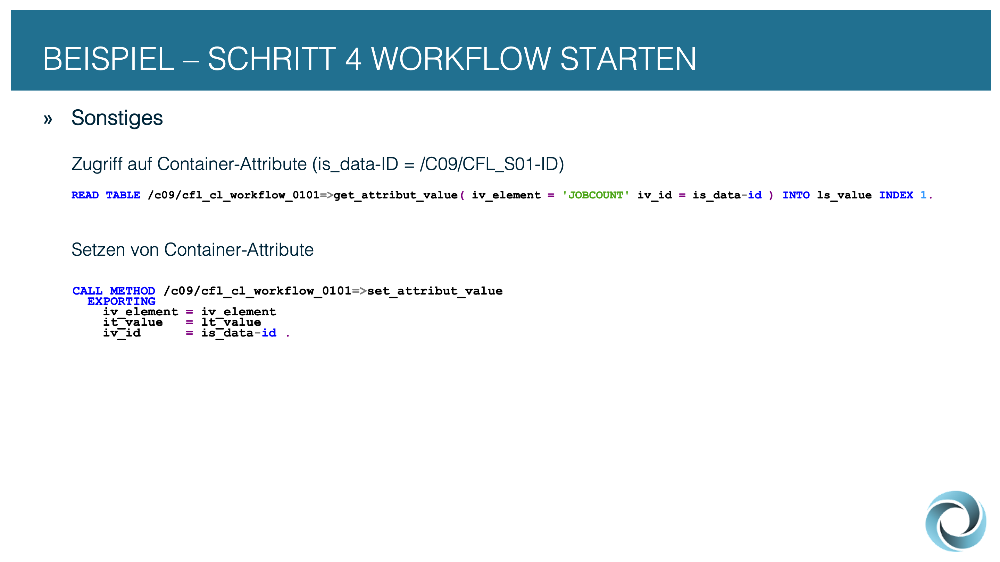
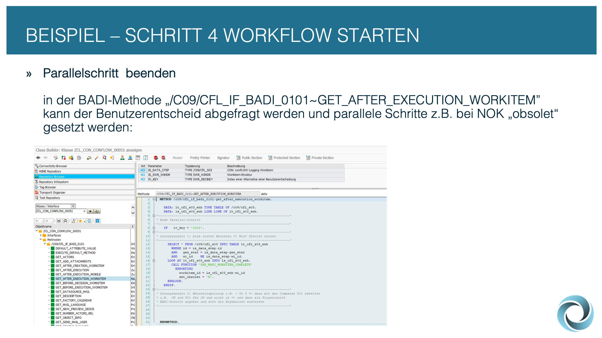
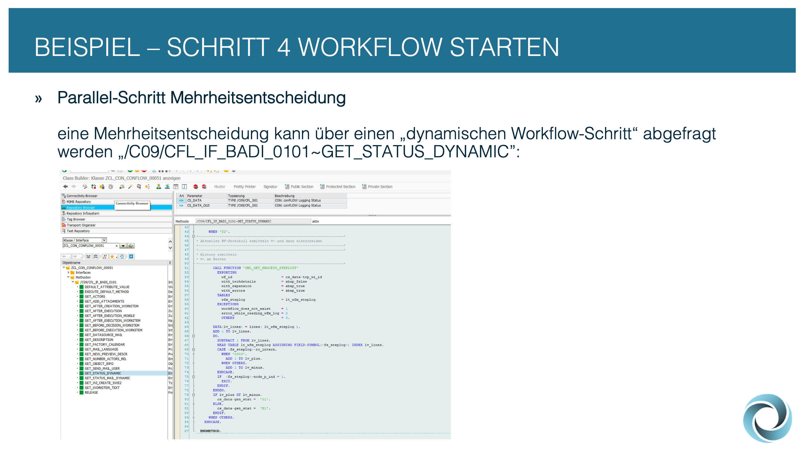

# 📝 Schritt 4: Workflow starten


Die nächsten Punkte zeigen, wie man den letzten Feinschliff dem erstellten conFLOW-Workflow geben kann.


<figure><figcaption></figcaption></figure>


Es gibt diverse Möglichkeiten, den Workflow zu starten (dazu auch mehr Informationen in der "Technischen Dokumentation").


<figure><figcaption></figcaption></figure>

<figure><figcaption></figcaption></figure>

<figure><figcaption></figcaption></figure>


Über die Methoden SET\_ATTRIBUTE\_VALUE bzw. GET\_ATTRIBUT\_VALUE können Daten in den conFLOW-Container geschrieben bzw. gelesen werden.


<figure><figcaption></figcaption></figure>


Um bei parallelen Tasks abhängig von den Userentscheidungen Operationen durchzuführen, kann die Methode GET\_AFTER\_EXECUTION\_WORKITEM der BADI-Implementierung zur Workflow-Definition verwendet werden.


<figure><figcaption></figcaption></figure>

<figure><figcaption></figcaption></figure>

