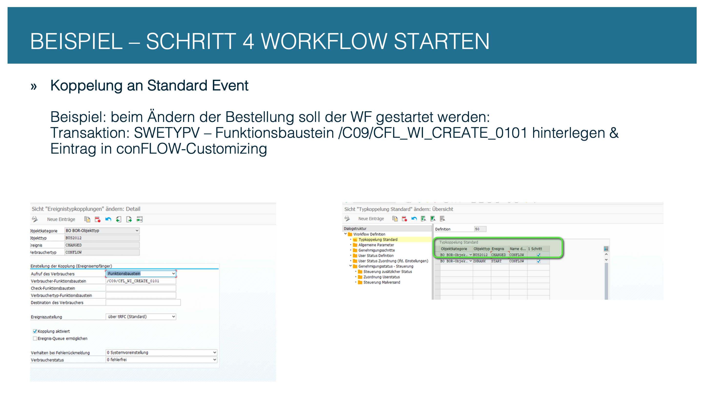
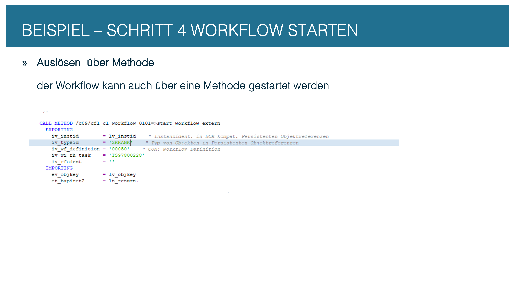

# Schritt 4: Workflow starten und testen

Der Workflow ist konfiguriert und die BAdI-Klasse implementiert. In diesem letzten Schritt richten wir den Trigger ein, befüllen den Container mit Fachdaten und testen den gesamten Prozess.

---

## 4.1 Überblick

<figure><figcaption><p>Vom Trigger zum laufenden Workflow</p></figcaption></figure>

---

## 4.2 Trigger-Varianten

Es gibt mehrere Wege, einen conFLOW-Workflow auszulösen. Die Wahl hängt vom Anwendungsfall ab:

| Variante | Wann einsetzen | Wie |
| --- | --- | --- |
| **Report / Programm** | Demos, Tests, manuelle Auslösung | `start_workflow_int( )` direkt aufrufen |
| **Anwendungs-BAdI** | Automatisch bei Belegänderung | Im Save-Exit des Anwendungsobjekts prüfen und starten |
| **Statusverwaltung** | Automatisch bei Statuswechsel | SAP-Statusverwaltung (BSVW) wirft BOR-Ereignis, SWETYPV-Kopplung löst den Workflow aus |


**Mehrfachstart-Schutz:** `start_workflow_int( )` prüft **nicht**, ob bereits ein Workflow für dasselbe Objekt läuft. Rufen Sie vorher `check_open_workflow( )` auf -- sonst entstehen parallele Instanzen für denselben Beleg.


<figure><figcaption><p>Variante A: Workflow aus einem Report oder Programm starten</p></figcaption></figure>

<figure><figcaption><p>Variante B: Workflow aus einem Anwendungs-BAdI starten</p></figcaption></figure>

<figure><figcaption><p>Variante C: Workflow über Statusverwaltung und BOR-Ereignis</p></figcaption></figure>

---

## 4.3 Container befüllen

Der **conFLOW-Container** (`/C09/CFL_S04`) speichert beliebige Fachdaten als Key-Value-Paare. Geschrieben wird über die Framework-Methoden:

```abap
" Wert schreiben
/c09/cfl_cl_workflow_0101=>set_attribut_value(
  iv_element = 'BELEGNR'
  iv_id      = ls_cfl_s03-id
  it_value   = VALUE #( ( lv_belegnr ) ) ).

" Wert lesen
DATA(lt_val) = /c09/cfl_cl_workflow_0101=>get_attribut_value(
                 iv_element = 'BELEGNR'
                 iv_id      = ls_cfl_s03-id ).
```


**Best Practice:** Attribut-Namen als Konstanten in eine eigene Klasse `ZCL_CFL_CONST_<nnnnn>` legen. Diese Klasse wird von der BAdI-Klasse, von Hintergrundschritten und ggf. von der UI gemeinsam genutzt -- eine Quelle für alle Attribut-Namen.


<figure><figcaption><p>SET_ATTRIBUT_VALUE und GET_ATTRIBUT_VALUE: der conFLOW-Container</p></figcaption></figure>

---

## 4.4 Nachlauflogik bei parallelen Schritten

Bei parallelen Workitems entscheiden mehrere Bearbeiter. Die BAdI-Methode `GET_AFTER_EXECUTION_WORKITEM` wird nach jeder einzelnen Entscheidung aufgerufen und erhält den Kontext: welcher Bearbeiter hat wie entschieden, und sind noch weitere Workitems offen.

Damit lässt sich z.B. nach der letzten Entscheidung eine Zusammenfassung berechnen oder eine Folgeaktion auslösen.

<figure><figcaption><p>Nachlauflogik nach parallelen Entscheidungen</p></figcaption></figure>

<figure><figcaption><p>Zusammenführung und Weiterverarbeitung</p></figcaption></figure>

---

## 4.5 Checkliste: erster Test

Bevor der Workflow produktiv geht, prüfen Sie folgende Punkte:

| Prüfpunkt | Wo prüfen |
| --- | --- |
| Workflow-Instanz wurde angelegt | `/C09/CFL_S01`: eine Zeile mit Ihrer `wf_definition` und `instid` |
| Workitems wurden erzeugt | `/C09/CFL_S03`: Zeilen mit der `id` aus `S01` |
| Bearbeiter stimmt | SWIA: Workitem öffnen, Bearbeiter prüfen |
| Container gefüllt | `/C09/CFL_S04`: Attribute mit der `id` aus `S01` |
| Entscheidung funktioniert | Workitem in SBWP oder Fiori My Inbox öffnen und entscheiden |
| Folgeschritt stimmt | Nach Entscheidung: nächster Schritt in `S01-gen_stat` |
| Workflow beendet sich | `S01-wf_end = 'X'` nach dem letzten Schritt |


**Der Workflow läuft.** Ab hier ist der Prozess funktional vollständig. Weitere Verfeinerungen -- bessere Texte, differenzierte Bearbeiterfindung, Fiori-Darstellung, conMOBILE-App -- sind Ausbaustufen, keine Voraussetzungen.

