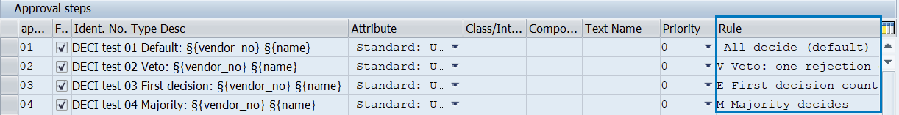

# Technische Dokumentation

Diese Seite beschreibt conFLOW vollständig: das Customizing-Modell, die Laufzeitdaten, die Schritttypen, die Bearbeiterfindung, den Mailversand und die BAdI-Schnittstelle. Sie ist als Ganzes lesbar und ersetzt die frühere Spezifikation als PDF.


**Wo Sie sonst noch nachsehen.** Jede BAdI-Methode einzeln, mit Quelltext, steht in der [Referenz aller 26 BAdI-Methoden](../how-to-beispielimplementierung/badi-referenz/README.md). Einen durchgängig gebauten Workflow zeigt das [How-To Krankmeldung](../how-to-beispielimplementierung/beispiel-workflow-krankmeldung/README.md).


---

## 1 Überblick

conFLOW ist ein Framework auf dem SAP Business Workflow. Ein Genehmigungsprozess entsteht nicht im Workflow Builder, sondern in Customizing-Tabellen: Schritte, Bearbeiter, Regeln, Belegdaten, Knöpfe und Mails sind Einstellungen. Für echte Ausnahmen gibt es eine BAdI-Schnittstelle. SAP-Workflow-Kenntnisse sind dafür nicht nötig.

Für **alle** conFLOW-Workflows liegt genau **ein** Workflow-Muster im System. Was ein einzelner Prozess tut, steht nicht in einem eigenen Muster, sondern in seinen Customizing-Zeilen. Deshalb gibt es keine Workflow-Entwicklung im klassischen Sinn: kein SWDD, keine Transportabhängigkeit zwischen Prozessänderung und Workflow-Definition.

```
Customizing  /C09/CFL_C*          wie der Prozess aussieht
      │                           Schritte · Übergänge · Bearbeiter · Fristen · Mail
      ▼
conFLOW-Framework                 erzeugt Workitems, findet Bearbeiter,
      │                           überwacht Fristen, versendet Mail, protokolliert
      ├──▶ BAdI-Klasse ZCL_CFL_WORKFLOW_<nnnnn>   optional: Sonderlogik, eine Klasse je Workflow
      ▼
SAP Business Workflow             generische conFLOW-Aufgaben, SBWP, Fiori My Inbox
      │
      ▼
Laufzeitdaten  /C09/CFL_S*        Instanz · Workitem-Historie · Container
```

Jeder Workflow hat eine fünfstellige Nummer, zum Beispiel `00900`. Diese Nummer ist der rote Faden: sie steht in der Workflow-Definition, sie ist der Filter der BAdI-Implementierung, und sie steht in jeder Laufzeitzeile.

## 2 Das Customizing-Modell

Einstieg ist die Transaktion `/C09/CONFLOW_C`, ein View-Cluster über alle Knoten.

| Knoten im Pflegebaum | Tabelle | Inhalt |
| --- | --- | --- |
| Workflow Definition | `/C09/CFL_C06` | eine Zeile je Workflow-Nummer; Beschriftung des Objekts in `C06T-OBJTEXT` |
| Genehmigungsschritte | `/C09/CFL_C01` | Schritte mit Status-Code `gen_stat`, Attribut, Texten, Klasse/Methode, Priorität (`PRIO`), Entscheidungsregel bei mehreren Bearbeitern |
| Genehmigungsstatus - Steuerung | `/C09/CFL_C02` | Übergänge (OK / NOK / Frist), Fristen |
| Steuerung zusätzlicher Status | `/C09/CFL_C09` | Entscheidungsalternativen `UC1`–`UC5` je Schritt; Farbe und Kommentarpflicht der Knöpfe (auch für OK/NOK); Regeln |
| User Status Definition | `/C09/CFL_C04` | Rollen, also die Bearbeiter-Keys `gen_stat_user` |
| User Status Zuordnung (lfd. Einstellungen) | `/C09/CFL_C03` | wer hinter einer Rolle steht: Benutzer, Organisation, PFCG-Rolle, Ausschlüsse |
| User Status Zuordnung (Voreinstellung für Transp.) | `/C09/CFL_C12` | transportfähige Voreinstellung dazu |
| Zuordnung Userstatus | `/C09/CFL_C05` | welche Rolle welchen Schritt bearbeitet |
| Steuerung Mailversand | `/C09/CFL_C07` | wer bei welcher Entscheidung welche Mail bekommt |
| Allgemeine Parameter | `/C09/CFL_C08` | Einstellungen je Workflow, siehe Abschnitt 10 |
| Typkoppelung Standard | `/C09/CFL_C10` | welches Ereignis welchen Workflow startet |


**Texte gehören nie in `C01`, `C06` oder `C09` selbst, sondern immer in die zugehörige `*t`-Tabelle.** Wer den Text in der Stammtabelle sucht, findet ihn nicht — und wer ihn dort pflegen will, verliert ihn bei der nächsten Sprache.


Jede Sicht des Pflegedialogs hat den Knopf *Dokumentation*: rechts erscheint eine Erklärung dieser Sicht. Über *Eigene Doku ändern/erweitern* lässt sich zu jeder Workflow-Definition eine eigene, versionierte Dokumentation anlegen; sie steht über der Standard-Doku, sobald sie vorhanden ist. Dokumente lassen sich außerdem über die GOS-Anbindung hochladen, im Pflegebaum am Knoten *Allgemeine Parameter*.

## 3 Den Workflow starten

Es gibt drei Wege. Der erste ist der empfohlene.

**Über ein Ereignis und die Typkoppelung.** In `/C09/CFL_C10` wird festgelegt, welches Ereignis welchen Workflow startet. Ein Eintrag verknüpft Objektkategorie, Objekttyp, Ereignis und den Empfängertyp `CONFLOW` mit einer Workflow-Definition. Damit das Ereignis conFLOW überhaupt erreicht, braucht es zusätzlich die **Ereignistypkopplung** im SAP-Standard (`SWETYPV`). Dort wird zu Objekttyp, Ereignis und Empfängertyp `CONFLOW` eingetragen:

| Einstellung | Wert |
| --- | --- |
| Aufruf des Verbrauchers | Funktionsbaustein |
| Verbraucher-Funktionsbaustein | **`/C09/CFL_WI_CREATE_0101`** (bei klassenbasierten Ereignissen `/C09/CFL_WI_CREATE_IBF_0101`) |
| Ereigniszustellung | über tRFC (Standard) |
| Kopplung aktiviert | gesetzt |

Ohne diesen Eintrag passiert beim Auslösen des Ereignisses nichts — das conFLOW-Customizing allein startet keinen Workflow. Die Felder auf conFLOW-Seite:

| Feld | Bedeutung |
| --- | --- |
| `WF_DEFINITION` | die Workflow-Definition, die gestartet wird |
| `OBJCATEG` | Objektkategorie, für BOR-Objekte `BO` |
| `OBJTYPE` | Objekttyp, z. B. `BUS2012` |
| `EVENT` | Ereignis des Objekttyps |
| `RECTYPE` | Empfängertyp, `CONFLOW` |
| `EXECUTE_FIRST` | im Pflegebild *1 Schritt auto* — der erste Schritt wird automatisch quittiert, der Workflow startet mit dem zweiten |


**`EXECUTE_FIRST` greift nur, wenn in den allgemeinen Parametern `GEN_TASK` gepflegt ist.** Ohne den generischen conFLOW-Task fehlt dem Framework die Aufgabe, die es automatisch quittieren soll — der Haken steht dann da und wirkt nicht.



**Objekttyp, Ereignis und Empfängertyp müssen eindeutig sein.** Ein zweiter Eintrag mit derselben Kombination startet womöglich den falschen Workflow. Und: **je Objekt und Workflow-Definition ist nur ein offener Workflow möglich.** Das Framework sucht beim Anlegen nach einer offenen Instanz zu Objektschlüssel, Objekttyp und Workflow-Definition; findet es eine, wird der Start mit einer Meldung abgewiesen, statt einen zweiten Workflow zu erzeugen. Eine *andere* Workflow-Definition darf zum selben Objekt gleichzeitig laufen.


**Über ein eigenes Ereignis aus Userexit, BAdI oder Enhancement.** Wenn kein Standardereignis passt, lässt sich der Workflow beim Sichern eines Objekts selbst auslösen. Der Aufruf nimmt optional gleich Container-Werte mit, die dann ab dem ersten Schritt zur Verfügung stehen:

```abap
DATA: ls_sweinstcou TYPE /c09/cfl_sweinstcou_st,
      ls_swhactor   TYPE swhactor,
      lt_container  TYPE swconttab,
      ls_container  LIKE LINE OF lt_container.

ls_sweinstcou-instid  = lv_belegnummer.
ls_sweinstcou-objtype = 'BUS2012'.
ls_sweinstcou-event   = 'CHANGED'.
ls_sweinstcou-rectype = 'CONFLOW'.

" optional - ohne Angabe wird SY-UNAME verwendet
ls_swhactor-otype = 'US'.
ls_swhactor-objid = sy-uname.

ls_container-element = 'BETRAG'.
ls_container-value   = lv_betrag.
APPEND ls_container TO lt_container.

/c09/cfl_cl_workflow_0101=>start_workflow_int(
  is_sweinstcou = ls_sweinstcou
  is_creator    = ls_swhactor
  it_container  = lt_container ).
```

**Direkt, ohne Ereignis.** Möglich über `/c09/cfl_cl_workflow_0101=>start_workflow_extern`, aber nicht der bevorzugte Weg: der Start hängt dann am rufenden Coding statt am Belegereignis.


`start_workflow_extern` prüft selbst, ob zum Objekt bereits ein Workflow offen ist. Trifft das zu, kommt eine Meldung in `ET_BAPIRET2` zurück und es wird kein zweiter Workflow gestartet.


## 4 Schritte und Schritttypen

Jeder Schritt hat einen zweistelligen Status-Code `gen_stat`. Der erste Buchstabe entscheidet über die Art des Schritts.

| Code | Bedeutung |
| --- | --- |
| `01`, `02`, … | Prozess-Schritte, fachliche Bedeutung je Workflow aus `C01` |
| `X0` | Workflow-Start |
| `X1` | Ende — genehmigt |
| `X2` | Ende — zurückgenommen |
| `X3` | Ende — abgelehnt |
| `Y1`–`Y5` | Weichen: der Folgestatus wird zur Laufzeit ermittelt, siehe unten |
| `B*` | Hintergrundschritte, laufen ohne Benutzer |

**Jeder Status, der mit `X` beginnt, beendet den Workflow.** Das Framework prüft den ersten Buchstaben und setzt das Kennzeichen `wf_end`. Die Bedeutung von `X1`, `X2` und `X3` ist Konvention — weitere `X*`-Status sind erlaubt.

**`X0` ist der einzige im Framework fest verdrahtete Status.** `C02` braucht eine Zeile mit `gen_stat = 'X0'`, deren OK-Ausgang auf den ersten echten Schritt zeigt. Dieser darf ein Hintergrundschritt sein.

In der Spalte *Attribut* (`ATTRIBUT`) der Genehmigungsschritte steuern fünf Festwerte das Verhalten. Der Normalfall ist der Leerwert:

| Attribut | Wirkung |
| --- | --- |
| *(leer)* | Standard: Entscheidungsaufgabe — der Bearbeiter entscheidet im Workitem |
| `BACK` | Hintergrundaufgabe im **Verbucher** — führt die hinterlegte Methode aus, kein Workitem |
| `BACK_BATCH` | Hintergrundaufgabe im **Batch** |
| `WAIT` | Warteschritt bei Parallelverarbeitung: der Workflow wartet, bis alle angestoßenen Subworkflows erledigt sind |
| `BADI` | der Folgeschritt wird dynamisch über das BAdI ermittelt, wie bei einem `Y`-Schritt |

Klasse und Methode eines Schritts stehen in `CLSNAME` und `CMPNAME`, der SO10-Text für den Workitem-Text in `TDNAME`.

### Weichen: `Y`-Schritte

Ein Schritt, dessen Code mit `Y` beginnt, ist ein Entscheidungspunkt ohne Bearbeiter. Nachdem conFLOW den Folgestatus aus `C02` ermittelt hat, sieht es sich diesen Schritt an: Beginnt sein Code mit `Y` — oder trägt er das Attribut `BADI` —, dann wird zuerst die in `C01` hinterlegte Klasse/Methode ausgeführt und anschließend die BAdI-Methode `GET_STATUS_DYNAMIC` gerufen. Beide bekommen den Zielstatus und den vorherigen Stand und dürfen den Zielstatus überschreiben.


**`GET_STATUS_DYNAMIC` läuft nicht bei jedem Statuswechsel.** Der Hook wird im Framework an genau einer Stelle gerufen, und nur unter dieser Bedingung: Zielschritt beginnt mit `Y`, oder Zielschritt trägt das Attribut `BADI`. Wer den Hook implementiert und den Schritt nicht entsprechend anlegt, wartet vergeblich auf seinen Aufruf.


Der Preis einer Weiche: der Laufweg steht an dieser Stelle nicht mehr im Customizing, sondern im Coding. Prüfen Sie deshalb der Reihe nach, ob nicht schon ein zusätzlicher Status in `C09`, eine Regel an einem Hintergrundschritt (Abschnitt 7) oder ein Hintergrundschritt mit `EV_DECISION_KEY` reicht — bei allen dreien bleibt der Verzweigungspunkt in `C02` sichtbar.

## 5 Ausgänge und Entscheidungswege

`C02` gibt jedem Schritt genau drei Ausgänge: OK, NOK und Fristablauf. Alles darüber hinaus steht in `C09`.

| Entscheidung | Schlüssel | Folgestatus aus |
| --- | --- | --- |
| OK | `0001` | `C02-gen_stat_ok` |
| NOK | `0002` | `C02-gen_stat_nok` |
| Fristablauf | — | `C02-gen_stat_frist` |
| `UC1` | `0003` | `C09-gen_stat_ok` |
| `UC2` | `0004` | `C09-gen_stat_ok` |
| `UC3` | `0005` | `C09-gen_stat_ok` |
| `UC4` | `0006` | `C09-gen_stat_ok` |
| `UC5` | `0007` | `C09-gen_stat_ok` |

Damit bietet jeder Schritt bis zu sieben Ausgänge. Der Schlüssel von `C09` ist `(wf_definition, gen_stat, gen_decision)` — **je Schritt eine eigene Zeile.** Fehlt sie, passiert beim Drücken des Knopfes nichts, ohne Fehlermeldung.

Über die Checkbox *keine Anzeige* (`NODISPLAY`) lässt sich eine Entscheidungsalternative verstecken. Der Ausgang existiert dann weiterhin und kann aus dem Coding gesetzt werden, dem Bearbeiter wird aber kein Knopf angeboten. Das ist der Weg für technische Ausgänge, die niemand von Hand wählen soll.

`C09` trägt drei weitere Spalten: `NATURE` färbt den Knopf grün (`P`) oder rot (`N`), `COMMENT_REQ` macht einen Kommentar zur Pflicht — beides im SAP GUI und in der Fiori My Inbox, auch für OK und NOK. `BEDINGUNG` hinterlegt eine Regel für den Ausgang, siehe Abschnitt 7.

### Schleife statt Neustart

Ein wiederkehrendes Muster: ein Beleg geht in die Nacharbeit und soll erneut bearbeitet werden.

| Tabelle | Schritt | Entscheidung | Folgestatus |
| --- | --- | --- | --- |
| `C09` | `01` | `UC4` | `B1` |
| `C02` | `B1` | OK | `01` — neues Workitem, gleiche Instanz |

Der Hintergrundschritt `B1` ist dabei bewusst leer. Sein Zweck ist nicht Logik, sondern Auswertbarkeit: jeder Durchlauf hinterlässt eine Zeile in der Historie. Ein direktes `01 → 01` wäre später nicht von einer normalen Wiedervorlage zu unterscheiden; mit `B1` lässt sich zählen, wie oft ein Beleg in die Nacharbeit ging.

## 6 Bearbeiterfindung

Zwei Schlüssel, die nicht verwechselt werden dürfen:

- **`gen_stat`** — *wo* steht der Prozess, also der Schritt-Code.
- **`gen_stat_user`** — *wer* ist dran, also der Bearbeiter-Key. Mehrere Schritte dürfen denselben Bearbeiter-Key haben.

In `C04` werden die Rollen definiert, in `C05` wird festgelegt, welche Rolle welchen Schritt bearbeitet, und in `C03` steht, wer tatsächlich hinter einer Rolle steckt. Möglich sind:

| Ausprägung | Bedeutung |
| --- | --- |
| `WF_INITIATOR` | der Ersteller des Workflows |
| SAP-Benutzer (`US`) | ein fester Benutzer |
| Organisationseinheit / Planstelle | Auflösung über die Aufbauorganisation |
| E-Mail-Adresse | nur für den Mailversand, kein Workitem |
| PFCG-Rolle (`AG` mit `AGR_NAME`) | alle Dialogbenutzer der Rolle; vom Administrator gesperrte Benutzer fallen heraus |
| Ausschließen (`EXCLUDE`) | was die Zeile auflöst, wird vom selben Bearbeiter-Key abgezogen — z. B. `WF_INITIATOR` für das Vier-Augen-Prinzip. Sonderwert `WF_APPROVERS`: wer auf einer anderen Stufe dieser Instanz schon entschieden hat |
| BAdI | die Ermittlung übernimmt `GET_ACTORS` — der Weg für BRFplus, Z-Tabellen oder Regelwerke |

Drei Bearbeiter-Keys haben eine feste Bedeutung: `BU` für Hintergrundschritte, `WI` für den Initiator und `$$` intern für Fristen-Schritte.


**`EXCLUDE` steuert die Bearbeiterfindung, nicht die Berechtigung.** Wer über die Workflow-Administration (`SWIA`) entscheidet, wird davon nicht aufgehalten.


`C12` enthält dieselbe Zuordnung wie `C03`, aber transportfähig. `C03` ist laufende Einstellung und wird im Zielsystem gepflegt; `C12` liefert die Voreinstellung mit.

### Parallele Bearbeiterwege

Mehrere Bearbeiter-Keys an einem Schritt ergeben mehrere Bearbeiter. Das Framework stellt die zutreffenden Rollen als Liste in das Container-Element `RT_NUMBER_ACTORS` — daraus entsteht **je Zeile ein Workitem**, alle gleichzeitig.

Was aus den einzelnen Entscheidungen wird, stellen Sie am Schritt ein: in den **Genehmigungsschritten** (`C01`) mit der Spalte **Entscheidungsregel** (kurz *Regel*).

<figure><figcaption><p>Vier Schritte, vier Regeln (Pflegedialog mit englischer Anmeldung)</p></figcaption></figure>

| Wert | Regel | Was passiert |
| --- | --- | --- |
| *(leer)* | **Alle entscheiden** | Jeder Bearbeiter entscheidet sein Workitem. Danach geht es weiter, eine Ablehnung ergibt NOK. Das ist das bisherige Verhalten, bestehende Schritte bleiben unverändert |
| `V` | **Veto** | Die erste Ablehnung beendet den Schritt mit NOK. Die übrigen Workitems werden geschlossen. Lehnt niemand ab, gilt dasselbe wie bei „Alle entscheiden“ |
| `E` | **Erste Entscheidung gilt** | Wer zuerst entscheidet, entscheidet für alle — OK, NOK oder ein zusätzlicher Ausgang `UC1`–`UC5`. Die übrigen Workitems werden geschlossen |
| `M` | **Mehrheit entscheidet** | Alle entscheiden, es gilt die häufigste Entscheidung. Gezählt werden OK, NOK und `UC1`–`UC5`. Bei Gleichstand gilt NOK |

Folgeschritt **und** Mail richten sich nach dem Ergebnis der Regel. Bei „Mehrheit“ mit zwei Zustimmungen und einer Ablehnung geht der Workflow also den OK-Weg, und es geht die Mail für OK hinaus, nicht die Ablehnungsmail.

Einige Dinge, die man wissen sollte:

- **Geschlossen heißt obsolet.** Die geschlossenen Workitems verschwinden wenige Sekunden nach der entscheidenden Stimme aus den Eingängen. Im Workflow-Protokoll stehen sie als *obsolet*.
- **Wer ein geschlossenes Workitem hatte, bekommt keine eigene Nachricht.** Soll das anders sein, richten Sie eine Mailregel auf das Ergebnis des Schritts ein.
- **Läuft ein Schritt erneut**, etwa nach einer Rückfrage, zählen nur die Entscheidungen des neuen Durchlaufs.
- **Entscheiden bei „Erste Entscheidung gilt“ zwei Personen im selben Augenblick**, zählt unter diesen beiden die Mehrheit, bei Gleichstand NOK.


**Bleiben die Workitems bei Veto oder „Erste Entscheidung gilt“ stehen?** Das Schließen läuft nach dem Sichern der Entscheidung in einem eigenen Schritt (tRFC). Wo es hängt, zeigt die Transaktion `SM58`.


### Eigene Logik im BAdI

Für Regeln, die keine der vier Einstellungen abdeckt — etwa eine gewichtete Stimme oder „zwei von drei aus verschiedenen Abteilungen“ —, bleibt das BAdI. Lassen Sie dann die Entscheidungsregel leer.

Einzelne Workitems schließen können Sie mit einem Helfer:

```abap
" im Hook GET_AFTER_EXECUTION_WORKITEM, der nach dem Abschluss eines Workitems laeuft
/c09/cfl_cl_helper_0101=>set_workitem_obsolet( is_data_step = is_data_step ).
COMMIT WORK AND WAIT.
```

`SET_WORKITEM_OBSOLET` sucht alle offenen Dialog-Workitems desselben Top-Workflows und setzt sie auf *obsolet* — das eigene ausgenommen. Soll das nur bei einer bestimmten Entscheidung geschehen, fragen Sie vorher `IV_KEY` ab.


**Achten Sie auf die Reichweite.** Der Helfer räumt den **ganzen Workflow** ab. Laufen parallele Workitems in mehreren Schritten gleichzeitig, trifft er auch die, die Sie behalten wollten. In dem Fall selbst selektieren und auf `GEN_STAT` einschränken — das Muster steht im [How-To](../how-to-beispielimplementierung/beispiel-workflow-krankmeldung/schritt-4-workflow-starten.md).


Eine eigene Auszählung setzen Sie in einen **Sammelschritt** hinter den Parallelschritt — einen `Y`-Schritt, auf den alle Ausgänge zeigen. Dort wird in `GET_STATUS_DYNAMIC` das Workflow-Protokoll ausgezählt und der Folgestatus gesetzt. Den Baustein dazu zeigt das [How-To](../how-to-beispielimplementierung/beispiel-workflow-krankmeldung/schritt-4-workflow-starten.md).


**Das `COMMIT` muss der Aufrufer schreiben.** Der Helfer ruft `SAP_WAPI_WORKITEM_COMPLETE` bewusst mit `DO_COMMIT = FALSE`, damit nicht je Workitem einzeln festgeschrieben wird. Fehlt die Zeile, bleiben die Workitems offen — **ohne Fehlermeldung**.


Den Hook im Detail, samt Abgrenzung zu `GET_AFTER_EXECUTION`, beschreibt die [BAdI-Referenz](../how-to-beispielimplementierung/badi-referenz/lebenszyklus/get-after-execution-workitem.md).

## 7 Hintergrundschritte

Ein Hintergrundschritt führt eine statische Methode aus, ohne Workitem und ohne Benutzer. Klasse und Methode stehen in `C01`. Die Methode bekommt die Workflow-Instanz und bestimmt über ihren Rückgabewert den weiteren Weg:

- `EV_DECISION_KEY` gesetzt → dieser Ausgang wird genommen (`0001` OK, `0002` NOK, `0003`–`0007` für `UC1`–`UC5`).
- `EV_DECISION_KEY` nicht gesetzt → entscheidet `ET_BAPIRET2`: eine Meldung vom Typ E oder A schickt den Workflow auf den NOK-Pfad, sonst geht es über OK weiter.

Ist zu einem Schritt mit Attribut `BACK` gar keine Methode hinterlegt, läuft er ohne Wirkung positiv durch.

Statt einer statischen Methode kann `CLSNAME` auch eine Klasse tragen, die das Interface `/C09/CFL_IF_BACKGROUND_0101` implementiert; `CMPNAME` bleibt dann leer. Die Signatur prüft in diesem Fall der Compiler.

**Regeln statt Methode.** Ist an einem `BACK_BATCH`-Schritt keine Klasse gepflegt, prüft conFLOW die Bedingungen in `C09-BEDINGUNG` der Ausgänge `UC1`–`UC5`, in dieser Reihenfolge. Der erste Treffer gewinnt; ohne Treffer geht es über OK weiter, bei einem Fehler über NOK. Die Felder stammen aus dem Template (`TEMPLATE` in `C08`). Dezimalzahlen stehen in Hochkommata und mit Punkt: `GESAMTWERT_RW <= '1000.20'`.

Die Meldungen aus einem Hintergrundschritt landen im Anwendungslog (SLG1). **Das geschieht nur, wenn in den allgemeinen Parametern ein `OBJECT` gepflegt ist** — ohne diesen Eintrag läuft der Schritt, aber es wird nichts protokolliert.

Umgekehrt gilt: Ist ein Schritt *nicht* als Hintergrundschritt gekennzeichnet und auch keine Klasse/Methode gepflegt, erzeugt conFLOW eine Standard-Entscheidungsaufgabe. Wer stattdessen ein eigenes Dynpro zeigen will, hinterlegt auch hier eine Klasse/Methode; deren `EV_DECISION_KEY` steuert dann den Ausgang.

## 8 Fristen und Eskalation

Fristen stehen in `C02`, in drei Feldern: `FRIST_STUNDEN` der Wert, `FRIST_MSEHI` die Einheit und `GEN_STAT_FRIST` der Status, auf den bei Ablauf gewechselt wird. Keine Deadline-Agents, kein Workflow-Customizing im SPRO — eine Tabellenzeile.


**Der Feldname `FRIST_STUNDEN` führt in die Irre.** Die Einheit ist frei wählbar und steht in `FRIST_MSEHI`; im Pflegebild heißt die Spalte darum schlicht *Anzahl*. Wer den Feldnamen liest und Stunden annimmt, rechnet falsch.


Welcher Fabrikkalender für die Berechnung gilt, lässt sich über die BAdI-Methode `GET_FACTORY_CALENDAR` bestimmen.

## 9 Mailversand

conFLOW versendet HTML-Mails, gesteuert über `C07`. Der Schlüssel ist vierteilig — **je Genehmigungsschritt, Entscheidung und Empfängerrolle eine Zeile**:

| Feld | Bedeutung |
| --- | --- |
| `GEN_STAT` | bei welchem Schritt versendet wird |
| `GEN_DECISION` | welche Entscheidung den Versand auslöst |
| `GEN_STAT_USER` | wer die Mail bekommt |
| `SUBJECT` | SO10-Text für den Betreff |
| `OBJID_HEADER` / `OBJID_ITEM` / `OBJID_FOOTER` | die drei HTML-Schablonen, aus denen die Mail aufgebaut wird |
| `TDNAME` | SO10-Text für den Inhalt |


**Die drei Schablonen sind Web-Objekte aus `SMW0`, keine SO10-Texte.** Betreff und Inhalt sind SO10-Texte, die Schablonen nicht — wer sie im SO10 sucht, findet sie nicht.


In den Texten und Schablonen stehen Platzhalter der Form `&STRUKTUR-FELD&`, die beim Aufbau der Mail ersetzt werden. Ist in den allgemeinen Parametern ein `TEMPLATE` gepflegt, stehen dessen Felder ohne Code bereit, z. B. `&/C09/CFL_S_TPL_BUS2012-GESAMTWERT_RW&`; Beträge und Mengen werden passend zu Währung und Einheit formatiert. Weitere Werte, etwa Protokoll (`&WF_PROT&`) oder Notizen (`&NOTE&`), liefert das BAdI über `GET_DATASOURCE_MAIL`.

**Sprache je Empfänger:** Mit der BAdI-Methode `GET_MAIL_LANGUAGE` lässt sich die Sprache für jeden Empfänger einzeln festlegen. Umgeschaltet wird nur, wenn die Sprache installiert ist und Betreff und Texte in ihr gepflegt sind; sonst geht die Mail in der Ausgangssprache hinaus.

**Dynamische Empfänger:** Beginnt der Bearbeiter-Key in `C07` mit `Y`, ruft das Framework die BAdI-Methode `GET_STATUS_MAIL_DYNAMIC`. Diese darf den Empfänger nicht nur ändern, sondern eine ganze Tabelle von Empfängern zurückgeben — der Weg für Verteiler, die erst zur Laufzeit feststehen. Gibt die Methode nichts zurück, bleibt es beim gepflegten Empfänger.

`Y` bedeutet an beiden Stellen dasselbe: *frag das BAdI*. Im Schritt-Code führt es zu `GET_STATUS_DYNAMIC`, im Empfänger-Key des Mailversands zu `GET_STATUS_MAIL_DYNAMIC`.

## 10 Allgemeine Parameter und Vererbung

`C08` hält Einstellungen je Workflow-Definition. Schlüssel ist die Workflow-Nummer plus der Parametername `PARAM`, der Wert steht in `VALUE`. Die zulässigen Namen sind Festwerte einer Domäne — ein neuer Parameter ist also ein neuer Festwert und keine Tabellenänderung.

| Parameter | Bedeutung |
| --- | --- |
| `OBJECT` / `SUBOBJECT` | Objekt und Unterobjekt des Anwendungslogs für Hintergrundschritte |
| `WF_DEF` | Vererbung: von welcher Workflow-Definition dieser Workflow das Customizing erbt |
| `GEN_TASK` | der generische conFLOW-Task, nötig für das automatische Quittieren des ersten Schritts |
| `LICENSE` | Lizenzangaben |
| `REPPR` | Vertreterprofil |
| `TCLASS` | Klassifikation von Aufgaben für die Vertretungsregelung |
| `TEMPLATE` | Template-Klasse: liest den Beleg und liefert die Felder für Regeln, Workitem-Titel und Mail. Mitgeliefert für `BUS2012`, `BUS2032`, `BUS2105`, `BUS2081`, `BKPF`, `LFA1`, `KNA1`, `BUS1006`; eigene per Vererbung oder Append |
| `RULE_CURR` | Regelwährung |
| `RATE_TYPE` | Kursart für Regeln |
| `VISU` | Semantic Object der Fiori-App, die das Workitem in der My Inbox öffnet (Action fest `openInInbox`). Leer = Standardanzeige. Bestehende Workitems zieht der Report `/C09/CFL_MIGRATE_VISU` nach |

### Was `WF_DEF` vererbt — und was nicht

Ein Workflow mit gepflegtem `WF_DEF` übernimmt das Customizing der Eltern-Definition. Übernommen werden `C01`, `C02`, `C03`, `C04`, `C05`, `C07` und `C09` samt ihren Texttabellen.


**Nicht vererbt werden die allgemeinen Parameter selbst (`C08`) und der Definitionstext (`C06T`).** Ein erbender Workflow hat also die Schritte und Ausgänge des Elternteils, aber nicht dessen Anwendungslog-Objekt, `TEMPLATE`, `VISU` oder `GEN_TASK` — diese Werte werden in jeder Definition eigens gepflegt. Wer sich darauf verlässt, bekommt einen Workflow, der läuft, aber nichts protokolliert.


Die eigenen Zeilen gewinnen: geerbte Zeilen werden hinten angehängt, auch wenn die eigene Definition denselben Schlüssel schon hat. Ein Zugriff trifft deshalb immer zuerst die eigene Zeile.

## 11 Subworkflows

In der Zuordnung Userstatus lässt sich je Entscheidung ein Subworkflow starten: `WF_DEFINITION_OK` (im Pflegebild *Definition OK*) bei Entscheidung OK, `WF_DEFINITION_NOK` (*Definition NOK*) bei NOK. Der Subworkflow ist eine eigene Workflow-Definition mit eigener Instanz.

Zum Schlüssel von `C05` gehört das Sortierfeld `SORTF`. Je Genehmigungsschritt sind daher **mehrere Zeilen** möglich — jede mit eigener Rolle und eigenem Subworkflow.


**Soll der Hauptworkflow auf den Subworkflow warten, braucht es einen Warteschritt.** Ohne einen Schritt mit Attribut `WAIT` läuft der Hauptworkflow weiter, während der Subworkflow noch offen ist. Der Warteschritt schaltet erst weiter, wenn kein angestoßener Workflow mehr offen ist.


## 12 Laufzeit-Datenmodell

Vier Tabellen, verbunden über die Instanz-`id`:

| Tabelle | Eine Zeile je | Wichtige Felder |
| --- | --- | --- |
| `/C09/CFL_S01` | Workflow-Instanz | `id`, `wf_definition`, `instid` (Objektschlüssel), `gen_stat` (aktueller Schritt), `wf_end` |
| `/C09/CFL_S03` | Workitem, chronologisch | `id`, `wi_id`, `gen_stat`, `gen_stat_user`, Anleger und Zeit |
| `/C09/CFL_S04` | Container-Element | `id`, `element`, `tab_index`, `value` |
| `/C09/CFL_S05` | Wertänderung am Container | `id`, `element`, `tstmp`, `wert_alt`, `wert_neu`, `aenam`, `kanal` — nur bei echter Änderung |

Der Schlüssel von `S04` enthält `TAB_INDEX` — ein Element kann also **mehrere Werte** tragen, nicht nur einen.

Damit entsteht ein vollständiger Audit Trail ohne eigene Z-Tabelle: wer hat wann welchen Schritt mit welchem Ergebnis bearbeitet, und welche Daten lagen zum Zeitpunkt der Entscheidung vor.


**Einstieg bei der Fehlersuche** ist fast immer derselbe Weg: `wi_id` → `/C09/CFL_S03` → `id` → `/C09/CFL_S01`.


## 13 Container und Datenübergabe

Der Container `/C09/CFL_S04` speichert beliebige Attribut-Wert-Paare je Instanz. Geschrieben und gelesen wird über die Framework-Methoden `SET_ATTRIBUT_VALUE` und `GET_ATTRIBUT_VALUE`. Werte können beim Start mitgegeben werden (siehe Abschnitt 3) oder in jedem Schritt entstehen.

Der Container ist zugleich die natürliche Quelle für Platzhalter in Workitem-Texten und Mails — und der Grund, warum der Audit Trail ohne Zusatzaufwand entsteht: was dort steht, ist später nachvollziehbar.

## 14 Die BAdI-Schnittstelle

Das Interface `/C09/CFL_IF_BADI_0101` definiert die Stellen, an denen Sonderlogik einhängt. Braucht ein Workflow sie, implementiert eine eigene Klasse `ZCL_CFL_WORKFLOW_<nnnnn>` dieses Interface; der Filter der Implementierung ist die Workflow-Nummer. Hooks, die Sie nicht brauchen, bleiben leer.

Für die Standardfälle braucht es keinen dieser Hooks: Bearbeiter (`C03`), Titel und Platzhalter (`C01T`, `C06T-OBJTEXT`), Knopffarbe und Kommentarpflicht (`C09`) sowie Belegdaten für Mail und Regeln (`TEMPLATE`) sind Einstellungen. Die Hooks sind für das, was darüber hinausgeht. Die wichtigsten:

| Hook | Aufgabe |
| --- | --- |
| `GET_ACTORS` | Bearbeiterfindung |
| `GET_DESCRIPTION` / `GET_WORKITEM_TEXT` | Titel und Text des Workitems |
| `GET_BEFORE_DECISION_WORKITEM` | Knöpfe steuern |
| `EXECUTE_DEFAULT_METHOD` | Absprung ins Belegobjekt |
| `GET_STATUS_DYNAMIC` | Folgestatus im Coding bestimmen (nur bei `Y`-Schritten, siehe Abschnitt 4) |
| `GET_STATUS_MAIL_DYNAMIC` | Mailempfänger im Coding bestimmen |
| `GET_DATASOURCE_MAIL` | Werte für die Platzhalter im Mailtext |
| `GET_FACTORY_CALENDAR` | Fabrikkalender für die Fristberechnung |


**Alle 26 Methoden, jede mit Zweck, Signatur, Quelltext und dem Hinweis, wann sie besser leer bleibt,** stehen in der [BAdI-Referenz](../how-to-beispielimplementierung/badi-referenz/README.md).


## 15 Oberflächen

Workitems erscheinen im SAP Business Workplace (`SBWP`) und in der SAP Fiori My Inbox. conFLOW steuert in beiden Beschriftung, Farbe und Kommentarpflicht der Knöpfe (`C09`/`C09T`), den Titel und den Absprung ins Belegobjekt aus demselben Customizing. Welche Fiori-App ein Schritt in der My Inbox öffnet, legt der Parameter `VISU` fest. Das BAdI bleibt für Abweichungen.

Zusätzlich lässt sich jeder Schritt mobil darstellen: eine conMOBILE-App liest denselben Container und verwendet dieselben Entscheidungsschlüssel. Eine Datenquelle, ein Entscheidungsmodell — unabhängig davon, wo entschieden wird.

Wer in der Fiori My Inbox eigene Eingabefelder am Workitem braucht, findet den gebauten Weg im [How-To zur Fiori-Oberfläche](../how-to-beispielimplementierung/fiori-oberflaeche-im-workitem/README.md).

## 16 Transaktionen und die Admin-Konsole

| Transaktion | Zweck |
| --- | --- |
| `/C09/CONFLOW_C` | conFLOW-Customizing — der View-Cluster über alle Knoten |
| `/C09/CFL_ADMIN_CON` | Admin-Konsole: laufende und abgeschlossene Workflows im Überblick |
| `/C09/CFL_START_WF_TE` | einen Workflow zu Testzwecken starten |


**`/C09/CONFLOW_C` startet im Anzeigemodus.** Die Transaktion ruft den View-Cluster mit gesetztem Anzeigekennzeichen auf. Wer pflegen will, schaltet nach dem Einstieg auf Ändern um.


### Die Admin-Konsole

Die Konsole beantwortet die Fragen, die im Betrieb täglich anfallen: Was läuft gerade, wo bleibt es liegen, und wer müsste etwas tun.

**Eingeschränkt wird** nach Workflow-Definition, Instanz und Objekttyp, nach Anlagedatum und -zeit des Workitems, nach Bearbeiter, Schritt-Code und Workitem-Status sowie nach dem Workitem-Text. Zwei Schalter entscheiden, ob laufende, abgeschlossene oder beide Workflows gezeigt werden. Umschalten lässt sich zwischen einer **Kopfsicht** je Workflow-Instanz und einer **Positionssicht** je Workitem.

**Die Liste** zeigt zu jedem Eintrag Workitem-Nummer, -Text und -Status, Anlage- und Änderungsdatum, den Bearbeiter im Klartext, von wem weitergeleitet wurde, die getroffene Entscheidung, die Angaben zur versendeten Mail sowie Priorität und Liegedauer. Eine Ampel bewertet offene Workitems gegen eine Schwelle in Tagen (voreingestellt drei): grün darunter, gelb ab 80 %, rot ab der Schwelle; ein eigenes Symbol markiert verwaiste Workitems ohne Bearbeiter. Schwelle 0 schaltet die Bewertung ab.

**Aus der Liste heraus** lassen sich das Workitem anzeigen und ausführen, die tatsächlichen Bearbeiter einblenden, die versendete Mail öffnen, ein Workitem weiterleiten und ein Workflow abbrechen. Der Abbruch wird protokolliert.

**Statt der Einzelliste** lässt sich eine **Auswertung** anzeigen: je Workflow-Definition und Schritt die Zahl der Vorgänge gesamt, offen und erledigt, die längste und die durchschnittliche Liegedauer der offenen, die längste und die durchschnittliche Durchlaufzeit der erledigten sowie die Verteilung der Entscheidungen samt Ablehnungsquote, mit derselben Ampel je Zeile. Das ist der schnellste Weg zu der Frage, an welchem Schritt ein Prozess wirklich hängt.

## 17 Objekte im System

Die Erweiterungsschnittstelle:

| Objekt | Name |
| --- | --- |
| Erweiterungsspot | `/C09/CFL_ENHANCEMENT_0101` |
| BAdI-Definition | `/C09/CFL_BADI_0101` — mehrfach verwendbar, ohne Fallback-Klasse |
| Interface | `/C09/CFL_IF_BADI_0101` |
| Filter | `WF_DEFINITION` — die Workflow-Nummer |


**`/C09/CFL_CL_BADI_0101` ist die mitgelieferte Beispielimplementierung, nicht die BAdI-Definition und nicht Ihre Implementierung.** Sie ist im Spot als Musterklasse registriert und zeigt Fragmente aus echten Projekten. Als Vorlage für eine eigene Implementierung dient die [Referenz aller 26 BAdI-Methoden](../how-to-beispielimplementierung/badi-referenz/README.md). Ihre eigene Logik gehört in eine eigene Klasse `ZCL_CFL_WORKFLOW_<nnnnn>` mit dem Filter auf Ihre Workflow-Nummer.


Die Klassen, die beim Lesen von Fehlern und beim Erweitern am häufigsten auftauchen:

| Bereich | Klassen |
| --- | --- |
| Ablauf | `/C09/CFL_CL_WORKFLOW_0101` (Start, Steuerung, Abbruch), `/C09/CFL_CL_WORKFLOW_EXIT_0101` (Workitem-Exit) |
| Bearbeiter und Regeln | `/C09/CFL_CL_ACTORS_0101`, `/C09/CFL_CL_RULE_0101`, `/C09/CFL_CL_DECIKEY_0101` |
| Mail und Texte | `/C09/CFL_CL_MAIL_0101`, `/C09/CFL_CL_MAIL_LANG_0101`, `/C09/CFL_CL_TEXTPARSER_0101`, `/C09/CFL_CL_OBJTEXT_0101` |
| Erweiterung | `/C09/CFL_IF_BADI_0101`, `/C09/CFL_IF_BACKGROUND_0101`, `/C09/CFL_IF_TEMPLATE_0101` |

Für gängige Geschäftsobjekte liefert conFLOW fertige **Templates** mit, die über den Parameter `TEMPLATE` direkt einsetzbar sind: Bestellung, Bestellanforderung, Kundenauftrag, Eingangsrechnung, Geschäftspartner, FI-Belegkopf, Kunde und Lieferant. Eigene Felder kommen per Vererbung oder Append dazu.

Für die langfristige Ablage gibt es ein eigenes **Archivierungsobjekt** samt Schreib- und Löschprogramm, mit dem abgeschlossene Workflows aus den Laufzeittabellen ausgelagert werden.
