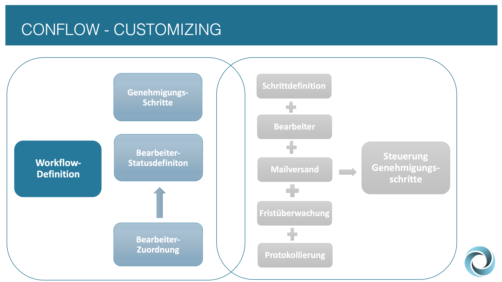
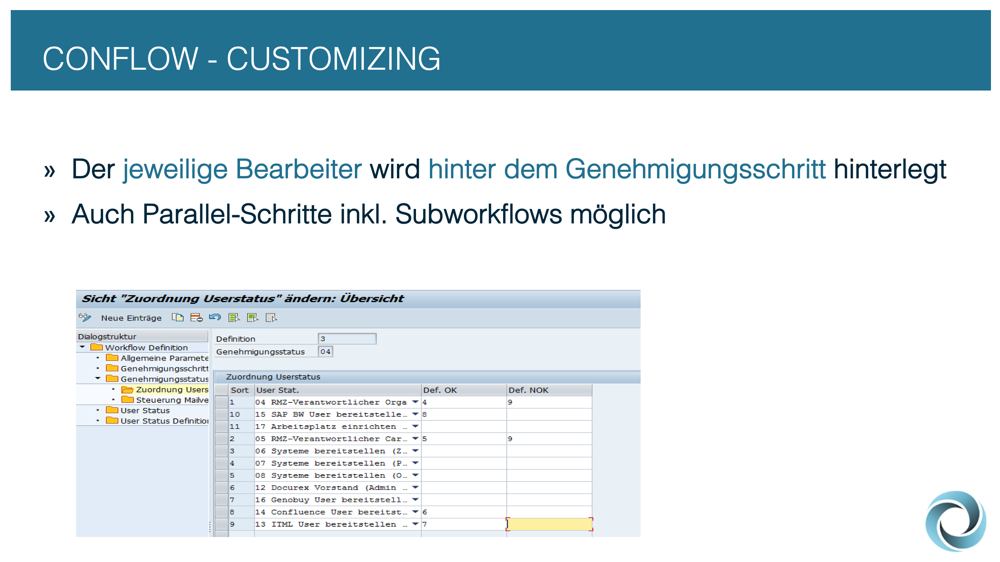
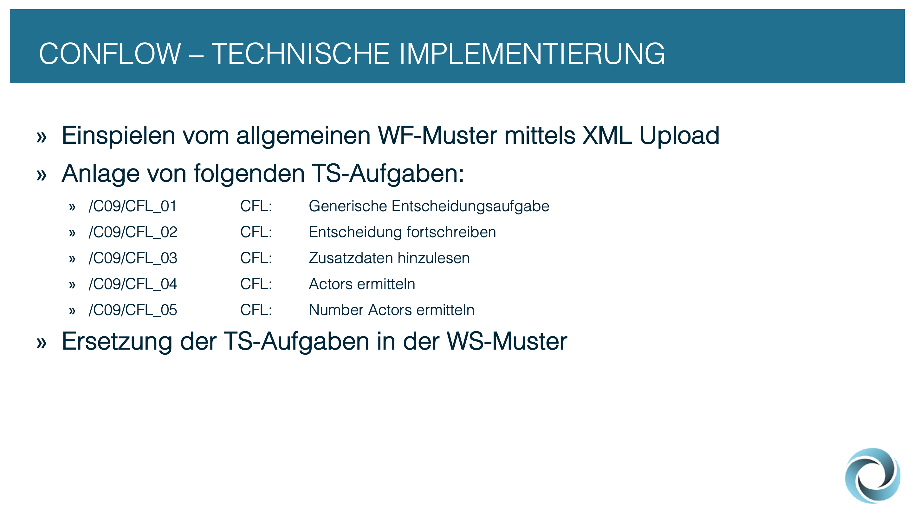
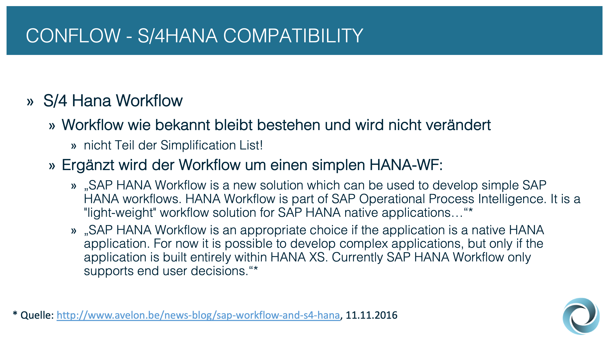
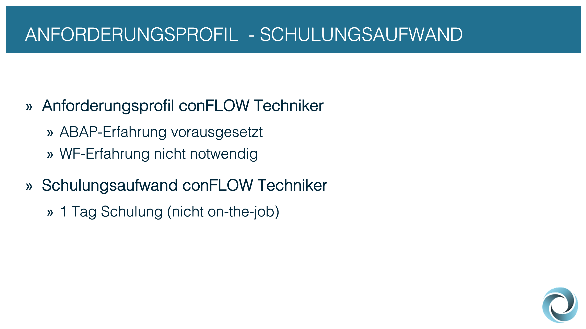
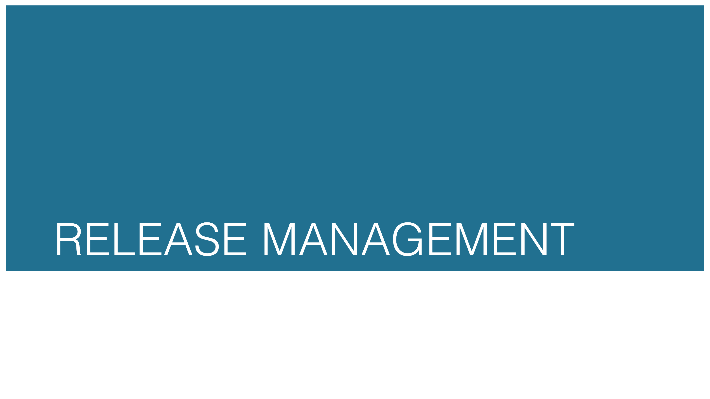
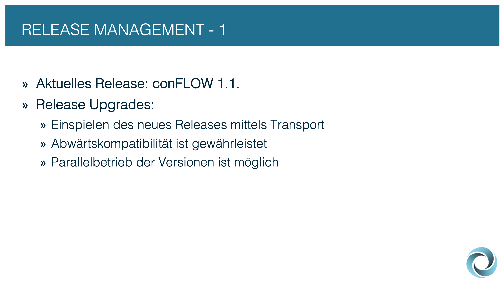

# Technische Dokumentation

Diese Dokumentation beschreibt die technische Architektur von conFLOW: das Datenmodell, die Customizing-Tabellen, die Laufzeit-Strukturen, das BAdI-Interface und die Integrationspunkte zum SAP Business Workflow.


**Die vollständige Spezifikation steht als PDF zum Download bereit.** Die Folien darunter geben einen visuellen Überblick über die wichtigsten Konzepte.




---

## Architektur und Überblick

conFLOW setzt auf dem SAP Business Workflow auf und steuert ihn über Customizing-Tabellen (`/C09/CFL_C*`) und eine BAdI-Schnittstelle (`/C09/CFL_IF_BADI_0101`). Die Laufzeit-Daten liegen in den Tabellen `/C09/CFL_S*`.

<figure><figcaption>
Architektur-Überblick
</figcaption></figure>

<figure><figcaption>
Komponenten und ihre Zusammenhänge
</figcaption></figure>

## Customizing-Modell

Die Workflow-Definition, ihre Schritte, Übergänge, Bearbeiter und Fristen werden vollständig in Customizing-Tabellen gepflegt. Die Transaktion `/C09/CONFLOW_C` ist der zentrale Einstieg.

<figure><figcaption>
Das Customizing-Modell im Überblick
</figcaption></figure>

<figure><figcaption>
Customizing-Tabellen und ihre Beziehungen
</figcaption></figure>

## Workflow-Definition und Schritte

Jeder Workflow hat eine eindeutige Nummer (z.B. `00208`) und wird in `/C09/CFL_C06` registriert. Die Schritte stehen in `/C09/CFL_C01`, die Übergänge in `/C09/CFL_C02`. Schritte können Dialogschritte (Workitem in der Inbox), Hintergrundschritte (automatische Verarbeitung) oder Endschritte sein.

<figure><figcaption>
Workflow-Definition und Schritttypen
</figcaption></figure>

<figure><figcaption>
Schritte und Übergänge
</figcaption></figure>

## Bearbeiterfindung und Rollen

Die Zuordnung von Schritten zu Bearbeitern erfolgt über Bearbeiter-Keys (`gen_stat_user`) in `/C09/CFL_C04` und `/C09/CFL_C05`. Die tatsächliche Auflösung -- welcher User das Workitem erhält -- kann fest im Customizing stehen oder dynamisch über die BAdI-Methode `GET_ACTORS` ermittelt werden.

<figure><figcaption>
Bearbeiterfindung: statisch und dynamisch
</figcaption></figure>

## Laufzeit-Datenmodell

Die Laufzeitdaten liegen in drei Tabellen: `/C09/CFL_S01` (eine Zeile je Workflow-Instanz), `/C09/CFL_S03` (eine Zeile je Workitem, chronologisch) und `/C09/CFL_S04` (Container-Elemente als Key-Value-Paare).

<figure><figcaption>
Laufzeit-Tabellen: S01, S03, S04
</figcaption></figure>

<figure><figcaption>
Zusammenhang zwischen Instanz, Workitems und Container
</figcaption></figure>

## BAdI-Interface

Das Interface `/C09/CFL_IF_BADI_0101` definiert die Hooks, über die fachliche Logik eingehängt wird. Jeder Workflow implementiert das Interface in einer eigenen Klasse `ZCL_CFL_WORKFLOW_<nnnnn>`. Die wichtigsten Hooks: `GET_ACTORS` (Bearbeiterfindung), `GET_DESCRIPTION` / `GET_WORKITEM_TEXT` (Workitem-Beschreibung), `GET_BEFORE_DECISION_WORKITEM` (Buttons steuern), `EXECUTE_DEFAULT_METHOD` (Absprung ins Belegobjekt).

<figure><figcaption>
BAdI-Hooks und ihre Aufgaben
</figcaption></figure>

<figure><figcaption>
Hook-Katalog im Detail
</figcaption></figure>

## Entscheidungsalternativen

Jeder Schritt bietet bis zu sieben Ausgänge: `OK` und `NOK` (gesteuert über `/C09/CFL_C02`) sowie `UC1` bis `UC5` (gesteuert über `/C09/CFL_C09`). Die Beschriftung der Buttons wird in den zugehörigen Texttabellen gepflegt.

<figure><figcaption>
Entscheidungsalternativen und ihre Steuerung
</figcaption></figure>

## Hintergrundschritte

Hintergrundschritte führen eine statische Methode automatisch aus -- ohne Workitem in einer Inbox. Die Methode erhält die aktuelle Workflow-Instanz und liefert einen Decision Key zurück, der den nächsten Schritt bestimmt. Damit lassen sich Weichen, Anreicherungen und automatische Buchungen im Prozess abbilden.

<figure><figcaption>
Hintergrundschritte: automatische Verarbeitung im Prozess
</figcaption></figure>

## Fristen und Eskalation

Fristen werden im Customizing (`/C09/CFL_C02`) hinterlegt: Wert, Einheit und Folgestatus bei Fristablauf. Keine Deadline-Agents, kein WF-Customizing im SPRO -- alles in einer Tabellenzeile.

<figure><figcaption>
Fristen und Eskalation über Customizing
</figcaption></figure>

## Mailversand

conFLOW versendet E-Mails je Schritt, gesteuert über das Customizing. Die Inhalte kommen aus SO10-Texten, in denen Platzhalter dynamisch ersetzt werden. Die BAdI-Methode `GET_DATASOURCE_MAIL` liefert die Ersetzungswerte.

<figure><figcaption>
Mailversand mit SO10-Texten und Platzhaltern
</figcaption></figure>

## Container und Datenübergabe

Der conFLOW-Container (`/C09/CFL_S04`) speichert beliebige Attribut-Wert-Paare je Workflow-Instanz. Geschrieben und gelesen wird über die Framework-Methoden `SET_ATTRIBUT_VALUE` und `GET_ATTRIBUT_VALUE`. Der Container ist auch der natürliche Audit Trail -- jeder Wert, der dort steht, ist später nachvollziehbar.

<figure><figcaption>
Container: Datenübergabe zwischen Schritten
</figcaption></figure>

## Workflow starten

Es gibt mehrere Wege, einen conFLOW-Workflow zu starten: über einen Anwendungs-BAdI (z.B. nach dem Sichern eines Belegs), über die SAP-Statusverwaltung (Statuswechsel löst ein BOR-Ereignis aus) oder über einen Report. Entscheidend ist die **Typkoppelung** in `/C09/CFL_C10`, die Ereignis und Workflow-Definition verknüpft.

<figure><figcaption>
Trigger-Varianten für den Workflow-Start
</figcaption></figure>

## Integration SAP-GUI und Fiori

Workitems erscheinen sowohl im SAP Business Workplace (SBWP, Transaktion `SBWP`) als auch in der SAP Fiori My Inbox. conFLOW steuert in beiden Oberflächen die Buttonbeschriftung, den Kontextblock und den Absprung ins Belegobjekt über dieselben BAdI-Hooks.

<figure><figcaption>
Integration in SAP-GUI und Fiori My Inbox
</figcaption></figure>

## conMOBILE-Integration

Die Integration mit conMOBILE ermöglicht die mobile Darstellung jedes Workflow-Schritts. Die conMOBILE-App liest denselben conFLOW-Container und verwendet dieselben Decision-Keys -- eine Datenquelle, ein Entscheidungsmodell.

<figure><figcaption>
Mobile Darstellung über conMOBILE
</figcaption></figure>

## Parallele Workflows und Synchronisierung

conFLOW unterstützt parallele Bearbeiterwege: mehrere Bearbeiter erhalten gleichzeitig ein Workitem, der Workflow wartet auf alle Entscheidungen, bevor er weitergeht. Die Konfiguration erfolgt über die Zuordnung mehrerer Bearbeiter-Keys zu einem Genehmigungsschritt.

<figure><figcaption>
Parallele Bearbeiterwege
</figcaption></figure>

## Statusverwaltung und Audit Trail

Der Workflow-Status wird in `/C09/CFL_S01` (aktueller Schritt) und `/C09/CFL_S03` (Historie aller Workitems) geführt. Zusammen mit dem Container (`S04`) ergibt sich ein vollständiger Audit Trail ohne eigene Z-Tabelle: wer hat wann welchen Schritt mit welchem Ergebnis bearbeitet, und welche Daten lagen zum Zeitpunkt der Entscheidung vor.

<figure><figcaption>
Statusverwaltung und Audit Trail
</figcaption></figure>

<figure><figcaption>
Nachvollziehbarkeit über S01, S03 und S04
</figcaption></figure>

## Erweiterte Szenarien

<figure><figcaption>
Erweiterte Szenarien und Ausbaustufen
</figcaption></figure>

<figure><figcaption>
Erweiterungsmöglichkeiten
</figcaption></figure>

<figure><figcaption>
Zusammenfassung der technischen Architektur
</figcaption></figure>
