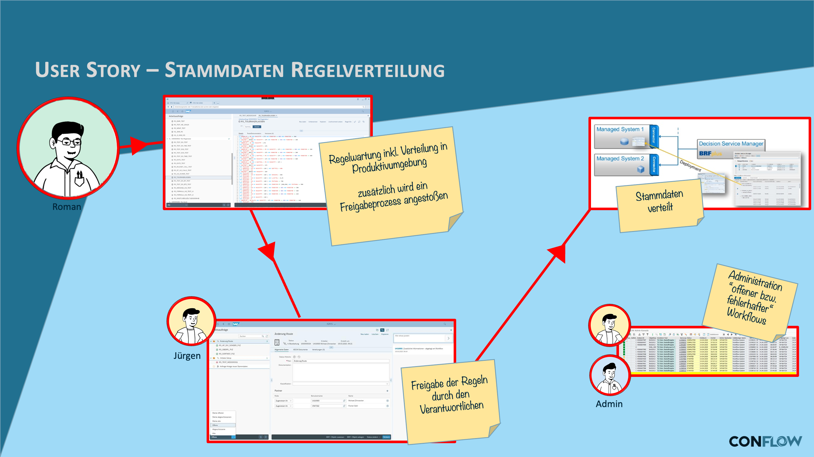

# BC Stammdaten Verteilung

## Die Anforderung

Stammdaten -- Materialstämme, Konditionen, Organisationseinheiten -- müssen in einer verteilten Systemlandschaft konsistent gehalten werden. Änderungen im führenden System müssen geprüft, freigegeben und an die Empfängersysteme verteilt werden. Fehler bei der Verteilung müssen erkannt und behandelt werden.

## Was conFLOW hier leistet

Der Workflow bildet den Freigabe- und Verteilungsprozess ab: eine Stammdatenänderung wird erfasst, der zuständige Fachbereich gibt sie frei, und ein Hintergrundschritt übernimmt die technische Verteilung. Scheitert die Verteilung, erzeugt conFLOW ein Workitem für den Basis-Betreuer mit den relevanten Fehlerinformationen.

Die Meldungen aus Hintergrundschritten werden automatisch im Anwendungslog (SLG1) protokolliert und können dort ausgewertet werden -- ohne eigene Z-Tabelle.

### User Story

<figure><figcaption>
Fachliche User Story: Stammdatenverteilung mit Freigabe
</figcaption></figure>

### Workflow

<figure><figcaption>
Technischer Laufweg: Freigabe und Verteilung
</figcaption></figure>
