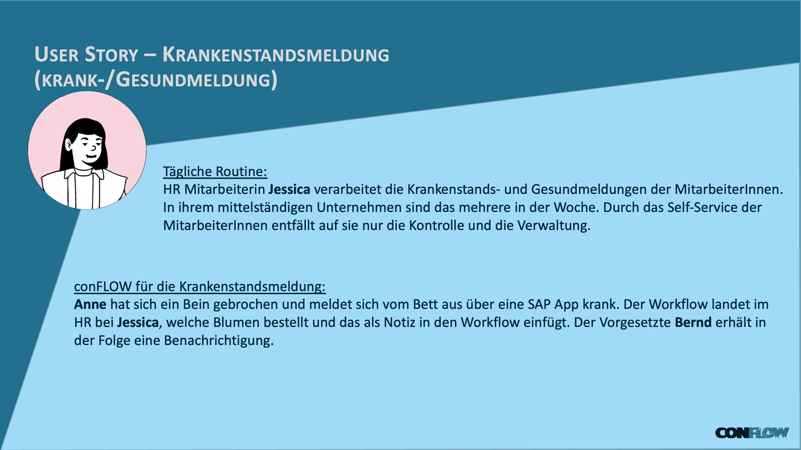
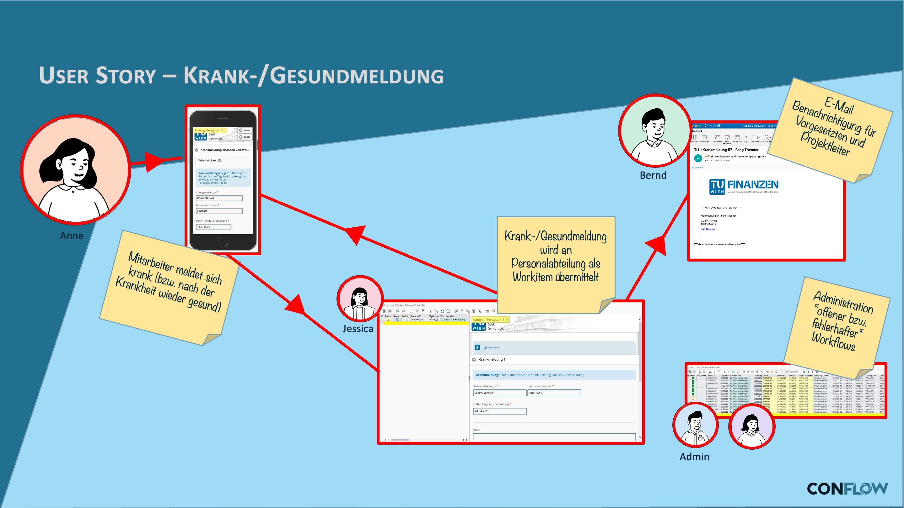

# HR Krankmeldung

## Die Anforderung

Ein Mitarbeiter meldet sich krank. Die Information muss zuverlaessig bei der Personalabteilung ankommen, dort bearbeitet und dokumentiert werden. Ohne Workflow geschieht das per Telefon oder E-Mail -- unstrukturiert, nicht nachvollziehbar und abhaengig davon, ob der richtige Ansprechpartner erreichbar ist.

## Was conFLOW hier leistet

| Schritt | Wer | Was passiert |
| --- | --- | --- |
| Meldung | Mitarbeiter | Erfasst die Krankmeldung -- der Workflow startet |
| Bearbeitung | Personalabteilung | Erhaelt ein Workitem, prueft und bestaetigt die Meldung |
| Abschluss | System | Workflow wird abgeschlossen, der Vorgang ist dokumentiert |

Der gesamte Prozess ist nachvollziehbar: wer hat wann gemeldet, wer hat wann bearbeitet, was war das Ergebnis. Die Personalabteilung findet die Meldung in ihrem Posteingang (SAP-GUI oder Fiori My Inbox), nicht in einer E-Mail zwischen hundert anderen.

### User Story

<figure><figcaption>
Fachliche User Story: Krankmeldung aus Sicht der Beteiligten
</figcaption></figure>

### Workflow

<figure><figcaption>
Technischer Laufweg des Workflows in conFLOW
</figcaption></figure>


**Dieser Workflow dient auch als Grundlage fuer das [How-To](../../how-to-beispielimplementierung/beispiel-workflow-krankmeldung/)** -- dort wird Schritt fuer Schritt gezeigt, wie er aufgebaut wird.

