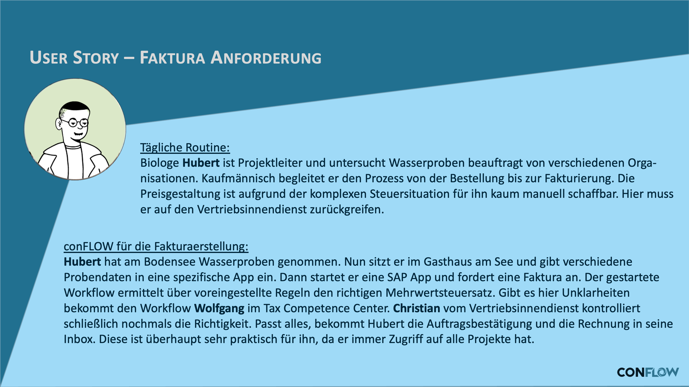

# SD Faktura Anforderung

## Die Anforderung

Bevor eine Rechnung an den Kunden geht, muss sie freigegeben werden -- insbesondere bei Sonderkonditionen, Gutschriften oder Abweichungen vom Standard. Ohne definierten Freigabeprozess passiert das per Zurufen oder gar nicht, und fehlerhafte Rechnungen fallen erst beim Kunden auf.

## Was conFLOW hier leistet

Der Workflow stellt sicher, dass jede relevante Faktura-Anforderung den richtigen Freigeber erreicht. Der Bearbeiter sieht am Workitem die wesentlichen Belegdaten und entscheidet: freigeben oder zurueckweisen. Bei Ablehnung geht der Vorgang zurueck an den Ersteller, bei Freigabe wird die Faktura erzeugt oder zur Erzeugung vorgemerkt.

Die Zuordnung des Freigebers kann ueber Customizing fest hinterlegt oder dynamisch ueber die BAdI-Methode `GET_ACTORS` ermittelt werden -- etwa abhaengig von Vertriebsbereich, Belegart oder Betrag.

### User Story

<figure><figcaption>
Fachliche User Story: Faktura-Freigabe im Vertrieb
</figcaption></figure>

### Workflow

<figure><figcaption>
Technischer Laufweg des Freigabe-Workflows
</figcaption></figure>
